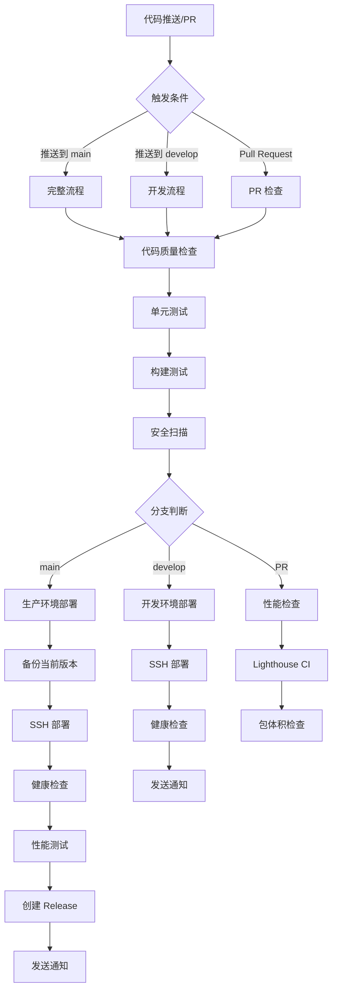

# GitHub Actions 工作流说明

## 工作流文件

### deploy.yml

主要的 CI/CD 工作流，负责代码检查、测试、构建和部署。

## 工作流程图



## 任务说明

### 1. lint（代码质量检查）

**目的**：确保代码符合规范

**检查项**：
- ESLint 代码规范检查
- Prettier 代码格式检查
- TypeScript 类型检查

**运行条件**：每次推送和 PR

### 2. test（单元测试）

**目的**：验证代码功能正确性

**测试内容**：
- 运行所有单元测试
- 生成测试覆盖率报告
- 上传覆盖率到 Codecov

**运行条件**：lint 通过后

### 3. build（构建测试）

**目的**：验证项目可以成功构建

**构建环境**：
- development（开发环境）
- production（生产环境）

**运行条件**：lint 和 test 通过后

### 4. deploy-dev（开发环境部署）

**目的**：自动部署到开发服务器

**部署步骤**：
1. 下载构建产物
2. SSH 连接到开发服务器
3. 上传文件到部署目录
4. 重启 Nginx
5. 健康检查
6. 发送 Slack 通知

**运行条件**：
- 推送到 develop 分支
- 或手动触发并选择 development 环境

### 5. deploy-prod（生产环境部署）

**目的**：自动部署到生产服务器

**部署步骤**：
1. 下载构建产物
2. 备份当前版本
3. SSH 连接到生产服务器
4. 上传文件到部署目录
5. 重启 Nginx
6. 健康检查
7. Lighthouse 性能测试
8. 发送 Slack 通知
9. 创建 GitHub Release

**运行条件**：
- 推送到 main 分支
- 或手动触发并选择 production 环境

### 6. security-scan（安全扫描）

**目的**：检测安全漏洞

**扫描内容**：
- npm audit（依赖漏洞）
- Snyk（安全扫描）
- CodeQL（代码安全分析）

**运行条件**：lint 通过后

### 7. performance-check（性能检查）

**目的**：确保性能指标达标

**检查内容**：
- Lighthouse CI 评分
- 构建产物大小检查
- 主要 chunk 大小检查

**运行条件**：PR 时，build 通过后

## 环境变量

### 开发环境

| 变量名 | 说明 |
|--------|------|
| `DEV_API_BASE_URL` | 开发环境 API 地址 |
| `DEV_CDN_BASE_URL` | 开发环境 CDN 地址 |
| `DEV_SSH_PRIVATE_KEY` | 开发服务器 SSH 私钥 |
| `DEV_SERVER_HOST` | 开发服务器地址 |
| `DEV_SERVER_USER` | 开发服务器用户名 |
| `DEV_SERVER_PORT` | 开发服务器 SSH 端口 |
| `DEV_DEPLOY_PATH` | 开发环境部署路径 |

### 生产环境

| 变量名 | 说明 |
|--------|------|
| `PROD_API_BASE_URL` | 生产环境 API 地址 |
| `PROD_CDN_BASE_URL` | 生产环境 CDN 地址 |
| `PROD_SSH_PRIVATE_KEY` | 生产服务器 SSH 私钥 |
| `PROD_SERVER_HOST` | 生产服务器地址 |
| `PROD_SERVER_USER` | 生产服务器用户名 |
| `PROD_SERVER_PORT` | 生产服务器 SSH 端口 |
| `PROD_DEPLOY_PATH` | 生产环境部署路径 |

### 第三方服务

| 变量名 | 说明 |
|--------|------|
| `CODECOV_TOKEN` | Codecov 上传令牌 |
| `SNYK_TOKEN` | Snyk 安全扫描令牌 |
| `SLACK_WEBHOOK` | Slack 通知 Webhook |
| `LHCI_GITHUB_APP_TOKEN` | Lighthouse CI 令牌 |

## 使用方法

### 自动触发

```bash
# 开发环境部署
git push origin develop

# 生产环境部署
git push origin main

# Pull Request 检查
git push origin feature/xxx
# 然后创建 PR 到 main
```

### 手动触发

1. 访问 GitHub Actions 页面
2. 选择 "CI/CD Pipeline" 工作流
3. 点击 "Run workflow"
4. 选择分支和环境
5. 点击 "Run workflow" 确认

## 故障排查

### 构建失败

1. 查看 GitHub Actions 日志
2. 检查错误信息
3. 本地复现问题
4. 修复后重新推送

### 部署失败

1. 检查 SSH 连接
2. 验证服务器配置
3. 查看服务器日志
4. 检查 Nginx 状态

### 测试失败

1. 本地运行测试
2. 查看失败的测试用例
3. 修复测试或代码
4. 重新提交

## 相关文档

- [CI/CD 完整指南](../../CI_CD_GUIDE.md)
- [快速参考手册](../../CI_CD_QUICK_REFERENCE.md)
- [配置检查清单](../../GITHUB_ACTIONS_CHECKLIST.md)

## 支持

如有问题，请联系：
- 技术支持：tech@startide-design.com
- 运维团队：ops@startide-design.com
