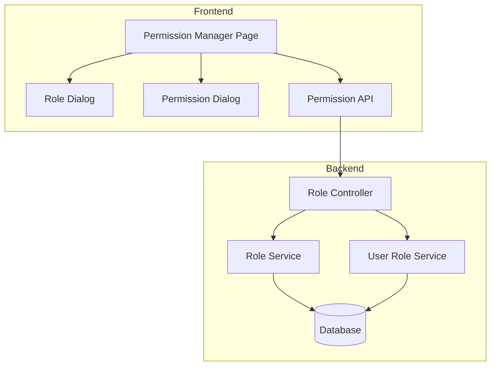

# Design Document: Permission Management

## Overview

权限管理功能为后台管理系统提供角色和权限的管理能力。该功能基于RBAC（基于角色的访问控制）模型，允许管理员创建自定义角色、为角色分配权限，从而实现细粒度的权限控制。

系统预设四种角色：
- **super_admin** (超级管理员): 拥有所有权限
- **moderator** (内容审核员): 负责内容审核相关操作
- **operator** (运营人员): 负责内容运营相关操作
- **user** (普通用户): 基础用户权限

## Architecture



### 技术栈
- **前端**: Vue 3 + TypeScript + Element Plus
- **后端**: Express + Prisma + PostgreSQL
- **状态管理**: Pinia (可选，用于缓存角色列表)

## Components and Interfaces

### 前端组件结构

```
src/views/Admin/Permissions/
├── index.vue                    # 主页面组件
├── components/
│   ├── RoleTable.vue           # 角色列表表格
│   ├── RoleDialog.vue          # 角色创建/编辑对话框
│   ├── PermissionDialog.vue    # 权限配置对话框
│   └── PermissionList.vue      # 权限列表展示
└── __test__/
    └── index.test.ts           # 组件测试
```

### 前端API接口 (src/api/permission.ts)

```typescript
// 角色相关接口
interface Role {
  roleId: string;
  roleName: string;
  roleCode: string;
  description: string | null;
  permissions: Permission[];
  createdAt: string;
  updatedAt: string;
}

interface Permission {
  permissionId: string;
  permissionName: string;
  permissionCode: string;
  module: string;
  description: string | null;
}

interface CreateRoleRequest {
  roleName: string;
  roleCode: string;
  description?: string;
  permissionIds?: string[];
}

interface UpdateRoleRequest {
  roleName?: string;
  description?: string;
  permissionIds?: string[];
}

// API方法
function getRoles(): Promise<ApiResponse<Role[]>>;
function createRole(data: CreateRoleRequest): Promise<ApiResponse<Role>>;
function updateRole(roleId: string, data: UpdateRoleRequest): Promise<ApiResponse<Role>>;
function deleteRole(roleId: string): Promise<ApiResponse<void>>;
function getAllPermissions(): Promise<ApiResponse<Permission[]>>;
function assignPermissions(roleId: string, permissionIds: string[]): Promise<ApiResponse<Role>>;
```

### 后端API路由

| Method | Path | Description | Permission |
|--------|------|-------------|------------|
| GET | /api/v1/admin/roles | 获取角色列表 | role:view |
| POST | /api/v1/admin/roles | 创建角色 | role:create |
| PUT | /api/v1/admin/roles/:roleId | 更新角色 | role:edit |
| DELETE | /api/v1/admin/roles/:roleId | 删除角色 | role:delete |
| GET | /api/v1/admin/permissions | 获取所有权限 | role:view |
| PUT | /api/v1/admin/roles/:roleId/permissions | 分配权限 | role:edit |

## Data Models

### 角色数据模型 (Role)

```typescript
interface Role {
  roleId: string;           // UUID
  roleName: string;         // 角色名称，唯一
  roleCode: string;         // 角色代码，唯一，如 'super_admin'
  description: string | null;
  permissions: Permission[];
  createdAt: Date;
  updatedAt: Date;
}
```

### 权限数据模型 (Permission)

```typescript
interface Permission {
  permissionId: string;     // UUID
  permissionName: string;   // 权限名称，如 '查看用户'
  permissionCode: string;   // 权限代码，唯一，如 'user:view'
  module: string;           // 所属模块，如 'user', 'resource', 'audit'
  description: string | null;
}
```

### 系统预设角色代码

```typescript
const SYSTEM_ROLE_CODES = ['super_admin', 'moderator', 'operator', 'user'];
```

### 权限模块分类

```typescript
const PERMISSION_MODULES = {
  user: '用户管理',
  resource: '资源管理',
  audit: '内容审核',
  category: '分类管理',
  operation: '内容运营',
  statistics: '数据统计',
  system: '系统设置',
  role: '权限管理'
};
```

## Correctness Properties

*A property is a characteristic or behavior that should hold true across all valid executions of a system-essentially, a formal statement about what the system should do. Properties serve as the bridge between human-readable specifications and machine-verifiable correctness guarantees.*

### Property 1: System Role Protection

*For any* system preset role (super_admin, moderator, operator, user), the Permission_Manager SHALL:
- Display a special badge/tag indicating it's a system role
- Disable the delete button
- Disable basic info editing (name, code) but allow permission editing

**Validates: Requirements 1.4, 3.3, 4.2**

### Property 2: Permission Grouping Display

*For any* permission list displayed in the UI, all permissions SHALL be grouped by their module field, and each permission SHALL display permissionName, permissionCode, module, and description.

**Validates: Requirements 5.2, 6.2**

### Property 3: Permission Pre-selection

*For any* role being edited in the permission configuration dialog, all permissions that the role currently possesses SHALL be pre-selected (checked) in the permission tree/list.

**Validates: Requirements 5.3**

### Property 4: Module Filter Correctness

*For any* module filter applied to the permission list, the filtered results SHALL contain only permissions where permission.module equals the selected module.

**Validates: Requirements 6.3**

### Property 5: Form Validation Rules

*For any* role creation or edit form:
- roleName field SHALL be required and non-empty
- roleCode field SHALL be required, non-empty, and disabled in edit mode
- description field SHALL be optional

**Validates: Requirements 2.2, 3.2**

## Error Handling

### 前端错误处理

| 错误场景 | 处理方式 |
|---------|---------|
| 角色列表加载失败 | 显示错误提示，提供重试按钮 |
| 角色代码已存在 | 表单验证错误，显示"角色代码已存在" |
| 角色名称已存在 | 表单验证错误，显示"角色名称已存在" |
| 删除系统预设角色 | 禁用删除按钮，hover显示提示 |
| 删除被使用的角色 | 显示错误对话框，说明使用该角色的用户数量 |
| 网络错误 | 显示通用网络错误提示 |
| 权限不足 | 显示权限不足提示，引导联系管理员 |

### 后端错误响应

```typescript
// 错误响应格式
interface ErrorResponse {
  code: number;
  message: string;
  data?: any;
}

// 错误码定义
const ERROR_CODES = {
  ROLE_CODE_EXISTS: 40001,      // 角色代码已存在
  ROLE_NAME_EXISTS: 40002,      // 角色名称已存在
  ROLE_NOT_FOUND: 40401,        // 角色不存在
  SYSTEM_ROLE_PROTECTED: 40301, // 系统预设角色受保护
  ROLE_IN_USE: 40302,           // 角色正在被使用
  PERMISSION_NOT_FOUND: 40402,  // 权限不存在
};
```

## Testing Strategy

### 单元测试

使用 Vitest 进行组件和函数的单元测试：

1. **API模块测试** (`src/api/__test__/permission.test.ts`)
   - 测试各API方法是否正确调用后端接口
   - 测试请求参数格式化
   - 测试响应数据解析

2. **组件测试** (`src/views/Admin/Permissions/__test__/index.test.ts`)
   - 测试角色列表渲染
   - 测试对话框打开/关闭
   - 测试表单验证
   - 测试系统角色保护逻辑

### 属性测试

使用 fast-check 进行属性测试，验证核心业务逻辑：

1. **Property 1**: 系统角色保护测试
   - 生成随机角色列表，验证系统预设角色的UI状态

2. **Property 2**: 权限分组测试
   - 生成随机权限列表，验证分组逻辑正确性

3. **Property 3**: 权限预选测试
   - 生成随机角色和权限组合，验证预选逻辑

4. **Property 4**: 模块筛选测试
   - 生成随机权限列表和筛选条件，验证筛选结果

5. **Property 5**: 表单验证测试
   - 生成随机表单数据，验证验证规则

### 测试配置

```typescript
// vitest.config.ts 中配置
// 属性测试最少运行100次迭代
```

### 测试标签格式

```typescript
// 属性测试标签格式
// Feature: permission-management, Property 1: System Role Protection
```
