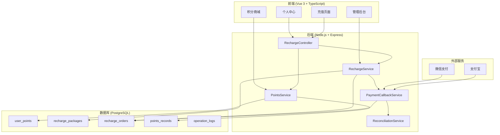
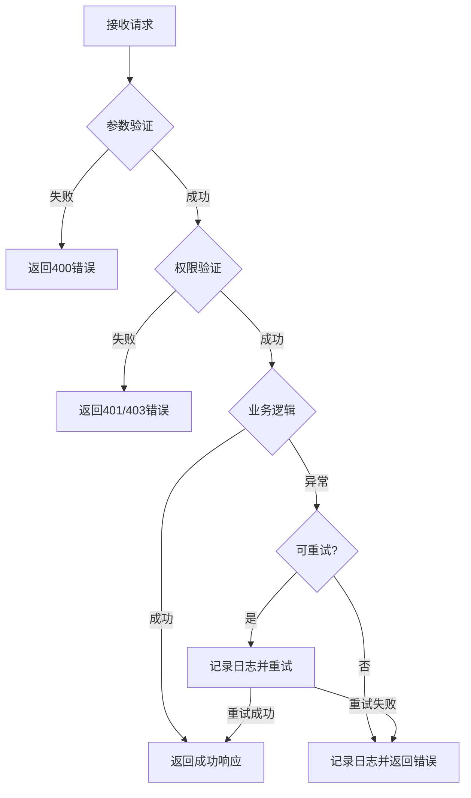

# 积分充值系统设计文档

## 概述

本设计文档基于已批准的需求文档，详细描述积分充值系统的技术架构、组件设计、数据模型和实现方案。系统将在现有Vue 3 + TypeScript前端和Node.js + Prisma后端架构基础上进行扩展开发。

### 设计目标

1. **复用现有架构**：充分利用现有的支付配置、积分服务、用户体系
2. **模块化设计**：各功能模块独立，便于维护和扩展
3. **数据一致性**：确保积分变动的原子性和可追溯性
4. **安全可靠**：支付回调验签、幂等处理、对账机制

## 架构设计

### 系统架构图



### 技术栈

| 层级 | 技术选型 | 说明 |
|------|---------|------|
| 前端框架 | Vue 3 + TypeScript | 复用现有架构 |
| UI组件库 | Element Plus | 复用现有组件 |
| 状态管理 | Pinia | 复用userStore扩展 |
| 后端框架 | Express + TypeScript | 复用现有架构 |
| ORM | Prisma | 复用现有数据访问层 |
| 数据库 | PostgreSQL | 复用现有数据库 |
| 支付SDK | wechatpay-node-v3, alipay-sdk | 复用现有支付配置 |
| 测试框架 | Vitest (前端), Jest + fast-check (后端) | 支持属性测试 |

## 组件与接口设计

### 后端服务层

#### 1. RechargeService (充值服务)

```typescript
// backend/src/services/rechargeService.ts

interface RechargePackage {
  packageId: string;
  packageName: string;
  price: number;           // 价格（元）
  basePoints: number;      // 基础积分
  bonusPoints: number;     // 赠送积分
  totalPoints: number;     // 总积分
  bonusRate: number;       // 赠送比例
  valuePerYuan: number;    // 积分/元
  sortOrder: number;
  isRecommend: boolean;
  status: number;          // 1=启用, 0=禁用
}

interface RechargeOrder {
  orderId: string;
  orderNo: string;
  userId: string;
  packageId: string;
  amount: number;
  totalPoints: number;
  paymentMethod: 'wechat' | 'alipay';
  paymentStatus: number;   // 0=待支付, 1=已支付, 2=已取消, 3=已退款
  transactionId?: string;
  expireAt: Date;
  paidAt?: Date;
  createdAt: Date;
}

class RechargeService {
  // 获取可用充值套餐列表
  async getAvailablePackages(): Promise<RechargePackage[]>;
  
  // 创建充值订单
  async createRechargeOrder(userId: string, packageId: string, paymentMethod: string): Promise<RechargeOrder>;
  
  // 查询订单状态
  async getOrderStatus(orderId: string): Promise<RechargeOrder>;
  
  // 取消超时订单
  async cancelExpiredOrders(): Promise<number>;
  
  // 处理支付成功
  async handlePaymentSuccess(orderNo: string, transactionId: string): Promise<void>;
  
  // 检查用户充值限制
  async checkRechargeLimit(userId: string): Promise<{ allowed: boolean; reason?: string }>;
}
```

#### 2. PaymentCallbackService (支付回调服务)

```typescript
// backend/src/services/payment/callbackService.ts

interface CallbackResult {
  success: boolean;
  orderNo: string;
  transactionId: string;
  amount: number;
  paidAt: Date;
}

class PaymentCallbackService {
  // 验证微信支付回调签名
  async verifyWechatCallback(headers: Record<string, string>, body: string): Promise<boolean>;
  
  // 验证支付宝回调签名
  async verifyAlipayCallback(params: Record<string, string>): Promise<boolean>;
  
  // 处理支付回调（幂等）
  async processCallback(channel: 'wechat' | 'alipay', data: any): Promise<CallbackResult>;
  
  // 记录回调日志
  async logCallback(orderNo: string, channel: string, data: any, result: string): Promise<void>;
}
```

#### 3. ReconciliationService (对账服务)

```typescript
// backend/src/services/reconciliation/reconciliationService.ts

interface ReconciliationResult {
  totalOrders: number;
  matchedOrders: number;
  mismatchedOrders: number;
  pendingOrders: number;
  autoFixedOrders: number;
}

class ReconciliationService {
  // 执行对账
  async reconcile(startDate: Date, endDate: Date): Promise<ReconciliationResult>;
  
  // 查找异常订单
  async findAnomalousOrders(): Promise<RechargeOrder[]>;
  
  // 自动补单
  async autoFix(orderId: string): Promise<boolean>;
  
  // 检测重复支付
  async detectDuplicatePayment(transactionId: string): Promise<boolean>;
}
```

#### 4. AdminPointsService (管理员积分服务)

```typescript
// backend/src/services/adminPointsService.ts

interface PointsAdjustment {
  userId: string;
  pointsChange: number;
  reason: string;
  adminId: string;
}

interface BatchGiftResult {
  totalUsers: number;
  successCount: number;
  failedCount: number;
  failedUsers: string[];
}

class AdminPointsService {
  // 单用户积分调整
  async adjustUserPoints(data: PointsAdjustment): Promise<void>;
  
  // 批量赠送积分
  async batchGiftPoints(userIds: string[], points: number, reason: string, adminId: string): Promise<BatchGiftResult>;
  
  // 撤销积分调整
  async revokeAdjustment(recordId: string, adminId: string): Promise<boolean>;
  
  // 检查是否需要二次审批
  async checkApprovalRequired(pointsChange: number, userCount: number): Promise<boolean>;
  
  // 获取调整日志
  async getAdjustmentLogs(options: { page: number; pageSize: number; adminId?: string }): Promise<any>;
}
```

### 前端组件设计

#### 1. 充值页面组件

```typescript
// src/views/Points/Recharge.vue

interface RechargePageState {
  packages: RechargePackage[];
  selectedPackage: RechargePackage | null;
  paymentMethod: 'wechat' | 'alipay';
  loading: boolean;
  orderInfo: RechargeOrder | null;
}

// 组件功能：
// - 展示充值套餐列表（3档）
// - 套餐选择与性价比展示
// - 支付方式选择
// - 订单创建与支付跳转
// - VIP用户提示
```

#### 2. 积分管理后台组件

```typescript
// src/views/Admin/Points/

// PackageManagement.vue - 套餐管理
// UserPointsAdjust.vue - 用户积分调整
// RechargeOrders.vue - 充值订单管理
// PointsStatistics.vue - 积分统计报表
```

### API接口设计

#### 用户端接口

| 方法 | 路径 | 说明 |
|------|------|------|
| GET | /api/v1/recharge/packages | 获取充值套餐列表 |
| POST | /api/v1/recharge/orders | 创建充值订单 |
| GET | /api/v1/recharge/orders/:orderId | 查询订单状态 |
| POST | /api/v1/recharge/orders/:orderId/cancel | 取消订单 |
| POST | /api/v1/payment/wechat/callback | 微信支付回调 |
| POST | /api/v1/payment/alipay/callback | 支付宝回调 |

#### 管理端接口

| 方法 | 路径 | 说明 |
|------|------|------|
| GET | /api/v1/admin/recharge/packages | 获取所有套餐 |
| POST | /api/v1/admin/recharge/packages | 创建套餐 |
| PUT | /api/v1/admin/recharge/packages/:id | 更新套餐 |
| DELETE | /api/v1/admin/recharge/packages/:id | 禁用套餐 |
| POST | /api/v1/admin/points/adjust | 调整用户积分 |
| POST | /api/v1/admin/points/batch-gift | 批量赠送积分 |
| POST | /api/v1/admin/points/revoke/:recordId | 撤销积分调整 |
| GET | /api/v1/admin/recharge/orders | 查询充值订单 |
| GET | /api/v1/admin/points/statistics | 获取积分统计 |

## 数据模型

### 新增数据表

#### 1. recharge_packages (充值套餐表)

```prisma
model recharge_packages {
  package_id    String   @id @default(uuid()) @db.VarChar(36)
  package_name  String   @db.VarChar(50)
  package_code  String   @unique @db.VarChar(50)
  price         Decimal  @db.Decimal(10, 2)
  base_points   Int
  bonus_points  Int
  bonus_rate    Decimal  @db.Decimal(5, 2)
  sort_order    Int      @default(0)
  is_recommend  Boolean  @default(false)
  status        Int      @default(1)
  created_at    DateTime @default(now()) @db.Timestamp(6)
  updated_at    DateTime @default(now()) @db.Timestamp(6)
  
  recharge_orders recharge_orders[]
  
  @@index([status])
  @@index([sort_order])
}
```

#### 2. recharge_orders (充值订单表)

```prisma
model recharge_orders {
  order_id        String    @id @default(uuid()) @db.VarChar(36)
  order_no        String    @unique @db.VarChar(50)
  user_id         String    @db.VarChar(36)
  package_id      String    @db.VarChar(36)
  amount          Decimal   @db.Decimal(10, 2)
  base_points     Int
  bonus_points    Int
  total_points    Int
  payment_method  String    @db.VarChar(20)
  payment_status  Int       @default(0)
  transaction_id  String?   @db.VarChar(100)
  expire_at       DateTime  @db.Timestamp(6)
  paid_at         DateTime? @db.Timestamp(6)
  cancelled_at    DateTime? @db.Timestamp(6)
  cancel_reason   String?   @db.VarChar(200)
  ip_address      String?   @db.VarChar(50)
  device_info     String?
  created_at      DateTime  @default(now()) @db.Timestamp(6)
  updated_at      DateTime  @default(now()) @db.Timestamp(6)
  
  users             users             @relation(fields: [user_id], references: [user_id])
  recharge_packages recharge_packages @relation(fields: [package_id], references: [package_id])
  
  @@index([user_id])
  @@index([order_no])
  @@index([payment_status])
  @@index([expire_at])
  @@index([created_at(sort: Desc)])
}
```

#### 3. recharge_callbacks (支付回调记录表)

```prisma
model recharge_callbacks {
  callback_id     String   @id @default(uuid()) @db.VarChar(36)
  order_no        String   @db.VarChar(50)
  channel         String   @db.VarChar(20)
  transaction_id  String?  @db.VarChar(100)
  callback_data   Json
  signature       String?  @db.VarChar(500)
  signature_valid Boolean?
  processed       Boolean  @default(false)
  process_result  String?  @db.VarChar(50)
  error_message   String?
  created_at      DateTime @default(now()) @db.Timestamp(6)
  
  @@index([order_no])
  @@index([processed])
  @@index([created_at(sort: Desc)])
}
```

#### 4. points_adjustment_logs (积分调整日志表)

```prisma
model points_adjustment_logs {
  log_id          String    @id @default(uuid()) @db.VarChar(36)
  admin_id        String    @db.VarChar(36)
  target_user_id  String    @db.VarChar(36)
  adjustment_type String    @db.VarChar(20)
  points_change   Int
  reason          String    @db.VarChar(500)
  is_revoked      Boolean   @default(false)
  revoked_at      DateTime? @db.Timestamp(6)
  revoked_by      String?   @db.VarChar(36)
  revoke_reason   String?   @db.VarChar(200)
  created_at      DateTime  @default(now()) @db.Timestamp(6)
  
  admin_user  users @relation("adjustment_admin", fields: [admin_id], references: [user_id])
  target_user users @relation("adjustment_target", fields: [target_user_id], references: [user_id])
  
  @@index([admin_id])
  @@index([target_user_id])
  @@index([created_at(sort: Desc)])
}
```

### 扩展现有表

#### users表扩展

```prisma
// 在现有users表中添加字段
model users {
  // ... 现有字段 ...
  
  // 充值相关
  daily_recharge_count  Int       @default(0)
  daily_recharge_amount Decimal   @default(0) @db.Decimal(10, 2)
  last_recharge_date    DateTime? @db.Date
  
  // 关联
  recharge_orders       recharge_orders[]
}
```

#### points_records表扩展

```prisma
// 在现有points_records表中添加字段
model points_records {
  // ... 现有字段 ...
  
  // 充值关联
  recharge_order_id String? @db.VarChar(36)
  
  // 可撤销标记
  is_revocable      Boolean @default(false)
  revoked           Boolean @default(false)
}
```

## 正确性属性

*正确性属性是系统必须满足的形式化规范，用于验证实现的正确性。每个属性都是一个普遍量化的陈述，描述了系统在所有有效输入下应该表现的行为。*

### Property 1: 套餐数据验证完整性

*对于任意*充值套餐数据，当创建或更新套餐时：
- 套餐名称必须唯一
- 价格必须为正数
- 基础积分 = 价格 × 10
- 总积分 = 基础积分 + 赠送积分
- 性价比 = 总积分 / 价格

**Validates: Requirements 1.1, 1.4**

### Property 2: 订单生命周期一致性

*对于任意*充值订单：
- 订单号必须全局唯一
- 订单创建后30分钟内未支付应自动取消
- 订单状态只能按照 待支付→已支付/已取消 流转
- 已取消的订单不能再次支付

**Validates: Requirements 2.2, 2.3**

### Property 3: 支付回调幂等性

*对于任意*支付回调请求：
- 相同transaction_id的回调只处理一次
- 签名验证失败的回调不处理积分发放
- 支付成功后积分发放与订单状态更新在同一事务中完成
- 重复支付自动触发退款，积分不重复发放

**Validates: Requirements 2.4, 2.5, 2.6, 2.8, 2.9**

### Property 4: 积分变动记录完整性

*对于任意*积分变动操作：
- 充值到账后必须生成积分变动记录
- 记录的change_type必须正确标记来源（recharge/admin_add/admin_deduct等）
- 积分余额 = 上一条记录余额 + 本次变动值
- 累计积分只在增加类型时增长

**Validates: Requirements 2.6, 3.6, 3.7**

### Property 5: 积分调整安全性

*对于任意*管理员积分调整操作：
- 扣除积分时，用户余额必须≥扣除数量
- 调整后积分余额不能为负数
- 调整原因长度必须在20-200字符之间
- 单次调整≥1000积分或批量≥100人时触发二次审批

**Validates: Requirements 3.3, 3.5, 3.9, 3.10**

### Property 6: 撤销操作有效性

*对于任意*积分调整撤销请求：
- 只能撤销24小时内的操作
- 只能撤销用户未消耗该部分积分的操作
- 撤销后用户积分余额恢复到调整前状态
- 撤销操作本身也生成日志记录

**Validates: Requirements 3.8**

### Property 7: 充值限制有效性

*对于任意*用户充值请求：
- VIP用户不允许充值（返回提示）
- 冻结账号不允许充值
- 每日充值次数不超过配置上限
- 每日充值金额不超过配置上限

**Validates: Requirements 2.10, 9.8, 4.9**

### Property 8: 统计数据准确性

*对于任意*时间范围的统计查询：
- 今日发放积分 = SUM(当日所有正向积分变动)
- 今日消耗积分 = ABS(SUM(当日所有负向积分变动))
- 系统总积分余额 = SUM(所有用户积分余额)
- 充值用户数 = COUNT(DISTINCT 有充值记录的用户)

**Validates: Requirements 7.1, 7.2, 7.5**

### Property 9: 套餐禁用数据完整性

*对于任意*被禁用的充值套餐：
- 前端查询不返回该套餐
- 历史订单仍能正确关联该套餐信息
- 套餐禁用不影响已支付订单的积分发放

**Validates: Requirements 1.2, 1.5**

### Property 10: 权限控制有效性

*对于任意*积分管理API请求：
- 无"积分管理"权限的管理员请求返回403
- 普通用户请求管理接口返回401
- 敏感操作（大额调整）需要二次验证

**Validates: Requirements 3.1, 8.3, 8.4**

## 错误处理

### 错误码定义

| 错误码 | 说明 | 处理方式 |
|--------|------|----------|
| POINTS_001 | 套餐不存在或已禁用 | 返回错误，提示用户刷新页面 |
| POINTS_002 | 订单已过期 | 返回错误，提示重新下单 |
| POINTS_003 | 积分余额不足 | 返回错误，提示充值 |
| POINTS_004 | 支付签名验证失败 | 记录日志，返回失败 |
| POINTS_005 | 重复支付检测 | 触发退款流程 |
| POINTS_006 | 用户账号异常 | 返回错误，提示联系客服 |
| POINTS_007 | 超出充值限制 | 返回错误，提示限制原因 |
| POINTS_008 | 调整原因不符合要求 | 返回错误，提示字数要求 |
| POINTS_009 | 无操作权限 | 返回403错误 |
| POINTS_010 | 撤销条件不满足 | 返回错误，说明原因 |

### 异常处理流程



## 测试策略

### 测试类型

1. **单元测试**：验证各服务函数的正确性
2. **属性测试**：使用fast-check验证正确性属性
3. **集成测试**：验证服务间协作
4. **端到端测试**：验证完整业务流程

### 属性测试配置

```typescript
// 使用fast-check进行属性测试
import fc from 'fast-check';

// 每个属性测试运行100次迭代
const testConfig = {
  numRuns: 100,
  verbose: true
};
```

### 测试覆盖要求

| 模块 | 单元测试覆盖率 | 属性测试数量 |
|------|---------------|-------------|
| RechargeService | ≥80% | 4 |
| PaymentCallbackService | ≥90% | 3 |
| AdminPointsService | ≥85% | 3 |
| 数据验证函数 | ≥95% | 2 |

### 关键测试场景

1. **套餐验证测试**
   - 有效套餐数据创建成功
   - 无效数据（负数价格、重复名称）被拒绝
   - 性价比计算正确

2. **支付回调测试**
   - 有效签名通过验证
   - 无效签名被拒绝
   - 重复回调幂等处理
   - 积分正确发放

3. **积分调整测试**
   - 余额充足时扣除成功
   - 余额不足时扣除失败
   - 调整记录完整生成
   - 撤销条件正确判断

4. **并发测试**
   - 同一订单并发回调处理
   - 同一用户并发充值
   - 批量积分赠送性能
