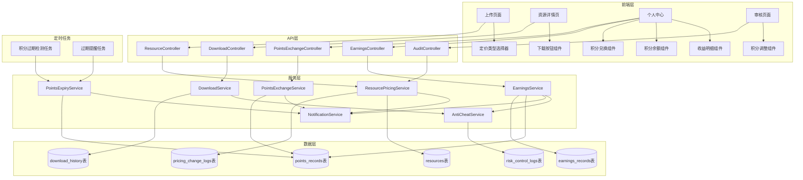
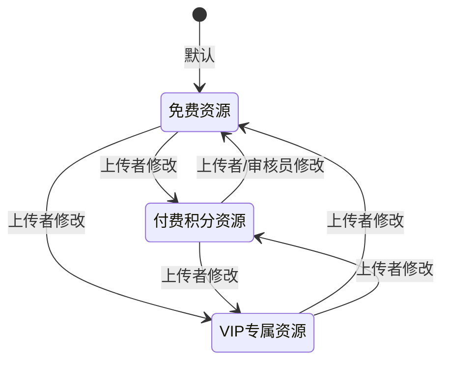

# 设计文档：作品积分定价功能

## 概述

本设计文档描述「作品积分定价功能」的技术架构和实现方案，旨在建立完整的「上传-定价-下载-收益-兑换」积分闭环体系。

该功能采用「系统限定框架 + 用户自主定价 + 审核兜底」的混合模式，在现有系统基础上进行最小化改造，新增 `pricing_type` 和 `points_cost` 字段，实现三种定价类型（免费、付费积分、VIP专属）的完整支持。

## 架构设计

### 系统架构图



### 定价类型状态机



## 组件与接口

### 1. 数据模型扩展

#### resources 表扩展

```typescript
// 新增字段
interface ResourcePricingFields {
  pricing_type: number;    // 定价类型: 0=免费, 1=付费积分, 2=VIP专属
  points_cost: number;     // 积分价格: 0-100, 仅pricing_type=1时有效
  is_deleted: boolean;     // 软删除标记，删除后保留数据
}
```

#### download_history 表扩展

```typescript
// 新增字段
interface DownloadHistoryExtension {
  earnings_awarded: boolean;  // 是否已发放收益
  uploader_id: string;        // 上传者ID（冗余字段，便于查询）
  downloader_type: string;    // 下载者类型: 'normal' | 'vip'
}
```

#### points_records 表扩展（现有表）

```typescript
// 现有表结构，补充说明字段用途
interface PointsRecordExtension {
  user_id: string;           // 用户ID
  points_change: number;     // 积分变动值（正数增加，负数减少）
  points_balance: number;    // 变动后余额
  change_type: string;       // 变动类型: 'earn' | 'consume' | 'exchange' | 'expired' | 'admin_add' | 'admin_deduct'
  source: string;            // 来源: 'work_downloaded' | 'download_resource' | 'points_exchange' | 'points_expired' | 'daily_task'
  source_id: string;         // 关联ID（资源ID/兑换ID等）
  description: string;       // 描述
  acquired_at: Date;         // 积分获取时间（新增，用于有效期计算）
  expire_at: Date;           // 积分过期时间（新增，获取时间+12个月）
}
```

#### 新增 earnings_records 表

```typescript
interface EarningsRecord {
  earning_id: string;         // 收益记录ID
  resource_id: string;        // 资源ID
  uploader_id: string;        // 上传者ID
  downloader_id: string;      // 下载者ID
  download_id: string;        // 下载记录ID
  pricing_type: number;       // 资源定价类型
  points_cost: number;        // 资源积分价格
  earnings_points: number;    // 实际收益积分
  earnings_source: string;    // 收益来源: 'normal_download' | 'vip_download' | 'platform_subsidy'
  status: string;             // 状态: 'pending' | 'awarded' | 'frozen' | 'cancelled'
  created_at: Date;
}
```

#### 新增 pricing_change_logs 表

```typescript
interface PricingChangeLog {
  log_id: string;
  resource_id: string;
  operator_id: string;        // 操作者ID（上传者或审核员）
  operator_type: string;      // 操作者类型: 'uploader' | 'auditor'
  old_pricing_type: number;
  new_pricing_type: number;
  old_points_cost: number;
  new_points_cost: number;
  reason: string;             // 修改原因
  created_at: Date;
}
```

#### 新增 risk_control_logs 表

```typescript
interface RiskControlLog {
  log_id: string;
  resource_id: string;
  trigger_type: string;       // 触发类型: 'high_frequency' | 'account_cluster' | 'new_account_burst'
  trigger_data: JSON;         // 触发数据详情
  status: string;             // 状态: 'pending' | 'approved' | 'rejected'
  reviewer_id: string;        // 审核员ID
  review_note: string;        // 审核备注
  reviewed_at: Date;
  created_at: Date;
}
```

### 2. 服务层接口

#### ResourcePricingService

```typescript
interface ResourcePricingService {
  // 设置资源定价
  setPricing(resourceId: string, pricingType: number, pointsCost: number): Promise<void>;
  
  // 批量设置定价
  setBatchPricing(resourceIds: string[], pricingType: number, pointsCost: number): Promise<void>;
  
  // 审核员调整定价
  adjustPricing(resourceId: string, auditorId: string, newPointsCost: number, reason: string): Promise<void>;
  
  // 获取定价信息
  getPricingInfo(resourceId: string): Promise<PricingInfo>;
  
  // 验证积分值合法性
  validatePointsCost(pointsCost: number): ValidationResult;
  
  // 软删除资源（保留收益记录）
  softDeleteResource(resourceId: string): Promise<void>;
}
```

#### DownloadService（扩展现有 resourceService）

```typescript
interface DownloadService {
  // 检查下载权限（返回积分获取渠道信息）
  checkDownloadPermission(userId: string, resourceId: string): Promise<DownloadPermission>;
  
  // 执行下载（含积分扣除）
  executeDownload(userId: string, resourceId: string, confirmed: boolean): Promise<DownloadResult>;
  
  // 获取下载确认信息
  getDownloadConfirmation(userId: string, resourceId: string): Promise<DownloadConfirmation>;
}

interface DownloadPermission {
  canDownload: boolean;
  reason?: string;
  pointsCost: number;
  userBalance: number;
  isVip: boolean;
  vipFreeDownload: boolean;
  // 积分不足时的获取渠道引导
  earnPointsChannels?: {
    name: string;
    url: string;
    description: string;
  }[];
}
```

#### EarningsService

```typescript
interface EarningsService {
  // 计算并发放收益
  awardEarnings(downloadId: string): Promise<EarningsResult>;
  
  // 获取收益明细（支持已删除资源标记）
  getEarningsHistory(uploaderId: string, options: QueryOptions): Promise<EarningsList>;
  
  // 获取收益统计
  getEarningsStats(uploaderId: string): Promise<EarningsStats>;
  
  // 冻结收益（风控触发）
  freezeEarnings(resourceId: string, reason: string): Promise<void>;
  
  // 恢复收益（风控审核通过）
  unfreezeEarnings(resourceId: string, reviewerId: string): Promise<void>;
}

interface EarningItem {
  earningId: string;
  resourceId: string;
  resourceTitle: string;
  resourceDeleted: boolean;  // 资源是否已删除
  resourceUrl?: string;      // 资源链接（已删除时为空）
  downloadTime: string;
  downloaderType: 'normal' | 'vip';
  earningsPoints: number;
  status: string;
}
```

#### AntiCheatService

```typescript
interface AntiCheatService {
  // 检查是否为有效下载（可产生收益）
  isValidDownload(downloaderId: string, resourceId: string, uploaderId: string): Promise<ValidityCheck>;
  
  // 检测账号关联性
  detectAccountCluster(accountIds: string[]): Promise<ClusterDetection>;
  
  // 触发风控预警
  triggerRiskAlert(resourceId: string, triggerType: string, triggerData: object): Promise<void>;
  
  // 获取下载频率统计
  getDownloadFrequency(resourceId: string, timeRange: TimeRange): Promise<FrequencyStats>;
}
```

#### PointsExchangeService（新增，扩展现有 pointsService）

```typescript
interface PointsExchangeService {
  // 获取可兑换权益列表
  getExchangeProducts(): Promise<ExchangeProduct[]>;
  
  // 执行积分兑换
  exchangePoints(userId: string, productId: string, deliveryAddress?: string): Promise<ExchangeResult>;
  
  // 获取用户兑换记录
  getUserExchangeRecords(userId: string, options: QueryOptions): Promise<ExchangeRecordList>;
  
  // 兑换失败回滚（自动退回积分）
  rollbackExchange(exchangeId: string, reason: string): Promise<void>;
  
  // 获取兑换审计日志（运营端）
  getExchangeAuditLogs(options: AuditLogQuery): Promise<ExchangeAuditLog[]>;
}

interface ExchangeResult {
  success: boolean;
  exchangeId?: string;
  errorCode?: string;
  errorMessage?: string;
}

interface ExchangeAuditLog {
  exchangeId: string;
  userId: string;
  productName: string;
  pointsCost: number;
  exchangeTime: Date;
  status: 'success' | 'failed' | 'refunded';
  ipAddress: string;
  deviceInfo: string;
}
```

#### PointsExpiryService（新增）

```typescript
interface PointsExpiryService {
  // 检测即将过期的积分（30天内）
  getExpiringPoints(userId: string): Promise<ExpiringPointsInfo>;
  
  // 发送过期提醒通知
  sendExpiryReminder(userId: string): Promise<void>;
  
  // 处理过期积分（定时任务调用）
  processExpiredPoints(): Promise<ProcessResult>;
  
  // 获取用户积分有效期明细
  getPointsExpiryDetails(userId: string): Promise<PointsExpiryDetail[]>;
}

interface ExpiringPointsInfo {
  totalExpiringPoints: number;
  expiryDate: Date;
  details: {
    points: number;
    acquiredAt: Date;
    expireAt: Date;
    source: string;
  }[];
}
```

#### NotificationService（扩展现有服务）

```typescript
// 扩展现有 notificationService.ts
export type NotificationType = 
  | 'audit_approved' 
  | 'audit_rejected' 
  | 'system' 
  | 'vip_expire'
  | 'earnings_received'      // 新增：收益到账通知
  | 'pricing_adjusted'       // 新增：定价被调整通知
  | 'points_expiring'        // 新增：积分即将过期通知
  | 'points_expired'         // 新增：积分已过期通知
  | 'exchange_success'       // 新增：兑换成功通知
  | 'exchange_failed'        // 新增：兑换失败通知
  | 'risk_control_warning';  // 新增：风控预警通知

// 新增通知发送函数
export async function sendEarningsNotification(params: {
  userId: string;
  resourceId: string;
  resourceTitle: string;
  earningsPoints: number;
  currentBalance: number;
}): Promise<void>;

export async function sendPricingAdjustedNotification(params: {
  userId: string;
  resourceId: string;
  resourceTitle: string;
  oldPointsCost: number;
  newPointsCost: number;
  reason: string;
}): Promise<void>;

export async function sendPointsExpiryNotification(params: {
  userId: string;
  expiringPoints: number;
  expiryDate: Date;
}): Promise<void>;
```

### 3. API 接口设计

#### 资源定价相关

```typescript
// POST /api/v1/resources/:resourceId/pricing
// 设置资源定价
interface SetPricingRequest {
  pricingType: 0 | 1 | 2;
  pointsCost?: number;  // 仅pricingType=1时必填
}

// GET /api/v1/resources/:resourceId/pricing
// 获取资源定价信息
interface PricingInfoResponse {
  pricingType: number;
  pointsCost: number;
  pricingLabel: string;  // '免费' | 'X积分' | 'VIP专属'
}
```

#### 下载相关

```typescript
// GET /api/v1/resources/:resourceId/download/confirm
// 获取下载确认信息
interface DownloadConfirmResponse {
  resourceId: string;
  title: string;
  pricingType: number;
  pointsCost: number;
  userPointsBalance: number;
  canDownload: boolean;
  reason?: string;
  isVip: boolean;
  vipFreeDownload: boolean;
  // 积分不足时的获取渠道
  earnPointsChannels?: {
    name: string;
    url: string;
    description: string;
  }[];
}

// POST /api/v1/resources/:resourceId/download
// 执行下载
interface DownloadRequest {
  confirmed: boolean;
}
```

#### 收益相关

```typescript
// GET /api/v1/user/earnings
// 获取收益明细
interface EarningsListResponse {
  list: EarningItem[];
  total: number;
  pageNum: number;
  pageSize: number;
  stats: {
    totalEarnings: number;
    monthEarnings: number;
    totalDownloads: number;
  };
}

interface EarningItem {
  earningId: string;
  resourceId: string;
  resourceTitle: string;
  resourceDeleted: boolean;
  resourceUrl?: string;
  downloadTime: string;
  downloaderType: 'normal' | 'vip';
  earningsPoints: number;
  status: string;
}
```

#### 积分相关（扩展现有API）

```typescript
// GET /api/v1/user/points
// 获取用户积分信息（扩展）
interface PointsInfoResponse {
  pointsBalance: number;
  pointsTotal: number;
  userLevel: number;
  levelName: string;
  // 新增：积分有效期信息
  expiringPoints: number;
  nearestExpiryDate?: string;
  expiryWarning?: string;  // 如："您有100积分将于2025-01-28过期"
}

// GET /api/v1/user/points/history
// 获取积分明细（扩展）
interface PointsHistoryResponse {
  list: PointsRecord[];
  total: number;
  pageNum: number;
  pageSize: number;
}

interface PointsRecord {
  recordId: string;
  pointsChange: number;
  pointsBalance: number;
  changeType: string;
  source: string;
  description: string;
  acquiredAt?: string;  // 新增：获取时间
  expireAt?: string;    // 新增：过期时间
  createdAt: string;
}

// GET /api/v1/user/points/expiry
// 获取积分有效期明细
interface PointsExpiryResponse {
  totalBalance: number;
  expiringIn30Days: number;
  details: {
    points: number;
    acquiredAt: string;
    expireAt: string;
    source: string;
    daysRemaining: number;
  }[];
}
```

#### 积分兑换相关

```typescript
// GET /api/v1/points/exchange/products
// 获取可兑换权益列表
interface ExchangeProductsResponse {
  list: ExchangeProduct[];
}

interface ExchangeProduct {
  productId: string;
  productName: string;
  productType: 'vip' | 'gift' | 'tool';
  pointsRequired: number;
  productValue: string;
  stock: number;
  imageUrl: string;
  description: string;
}

// POST /api/v1/points/exchange
// 执行积分兑换
interface ExchangeRequest {
  productId: string;
  deliveryAddress?: string;  // 实物礼品需要
}

interface ExchangeResponse {
  success: boolean;
  exchangeId?: string;
  pointsBalance?: number;
  errorCode?: string;
  errorMessage?: string;
}

// GET /api/v1/user/points/exchange/records
// 获取用户兑换记录
interface ExchangeRecordsResponse {
  list: ExchangeRecord[];
  total: number;
  pageNum: number;
  pageSize: number;
}

// GET /api/v1/admin/points/exchange/audit-logs
// 获取兑换审计日志（运营端）
interface ExchangeAuditLogsResponse {
  list: ExchangeAuditLog[];
  total: number;
  pageNum: number;
  pageSize: number;
}
```

#### 风控审核相关（运营端）

```typescript
// GET /api/v1/admin/risk-control/list
// 获取风控预警列表
interface RiskControlListResponse {
  list: RiskControlItem[];
  total: number;
  pageNum: number;
  pageSize: number;
}

// POST /api/v1/admin/risk-control/:logId/review
// 审核风控预警
interface RiskControlReviewRequest {
  status: 'approved' | 'rejected';
  reviewNote: string;
}
```

### 4. 前端组件设计

#### PricingTypeSelector 组件

```vue
<template>
  <div class="pricing-type-selector">
    <el-radio-group v-model="pricingType" @change="handleTypeChange">
      <el-radio :label="0">免费资源</el-radio>
      <el-radio :label="1">付费积分资源</el-radio>
      <el-radio :label="2">VIP专属资源</el-radio>
    </el-radio-group>
    
    <div v-if="pricingType === 1" class="points-cost-input">
      <el-select v-model="pointsCost" placeholder="选择积分">
        <el-option 
          v-for="value in pointsOptions" 
          :key="value" 
          :label="`${value}积分`" 
          :value="value" 
        />
      </el-select>
      <el-slider 
        v-model="pointsCost" 
        :min="5" 
        :max="100" 
        :step="5"
        show-stops
      />
    </div>
  </div>
</template>
```

#### PricingBadge 组件

```vue
<template>
  <el-tag :type="badgeType" size="small">
    {{ badgeText }}
  </el-tag>
</template>

<script setup lang="ts">
const props = defineProps<{
  pricingType: number;
  pointsCost: number;
}>();

const badgeType = computed(() => {
  switch (props.pricingType) {
    case 0: return 'success';
    case 1: return 'warning';
    case 2: return 'danger';
    default: return 'info';
  }
});

const badgeText = computed(() => {
  switch (props.pricingType) {
    case 0: return '免费';
    case 1: return `${props.pointsCost}积分`;
    case 2: return 'VIP';
    default: return '未知';
  }
});
</script>
```

#### DownloadConfirmDialog 组件

```vue
<template>
  <el-dialog v-model="visible" title="下载确认" width="400px">
    <div class="confirm-content">
      <p>资源：{{ resourceTitle }}</p>
      <p>需扣除：<span class="points">{{ pointsCost }}积分</span></p>
      <p>当前余额：<span class="balance">{{ userBalance }}积分</span></p>
      <div v-if="insufficientPoints" class="warning">
        <p>积分不足，还需{{ pointsCost - userBalance }}积分</p>
        <div class="earn-channels">
          <el-button 
            v-for="channel in earnChannels" 
            :key="channel.name"
            type="text" 
            @click="goToChannel(channel.url)"
          >
            {{ channel.name }}
          </el-button>
        </div>
      </div>
    </div>
    <template #footer>
      <el-button @click="visible = false">取消</el-button>
      <el-button type="primary" :disabled="insufficientPoints" @click="confirmDownload">
        确认下载
      </el-button>
    </template>
  </el-dialog>
</template>
```

#### PointsBalanceCard 组件（新增）

```vue
<template>
  <div class="points-balance-card">
    <div class="balance-info">
      <span class="label">当前积分</span>
      <span class="value">{{ pointsBalance }}</span>
    </div>
    <div v-if="expiringPoints > 0" class="expiry-warning">
      <el-icon><Warning /></el-icon>
      <span>{{ expiryWarning }}</span>
    </div>
    <div class="actions">
      <el-button type="primary" size="small" @click="goToExchange">去兑换</el-button>
      <el-button size="small" @click="goToHistory">积分明细</el-button>
    </div>
  </div>
</template>
```

#### PointsExchangePanel 组件（新增）

```vue
<template>
  <div class="points-exchange-panel">
    <div class="exchange-header">
      <h3>积分兑换</h3>
      <p class="balance">当前积分：{{ pointsBalance }}</p>
    </div>
    
    <div class="product-list">
      <div 
        v-for="product in products" 
        :key="product.productId"
        class="product-card"
      >
        <el-image :src="product.imageUrl" fit="cover" />
        <div class="product-info">
          <h4>{{ product.productName }}</h4>
          <p class="points-required">{{ product.pointsRequired }}积分</p>
          <el-button 
            type="primary" 
            size="small"
            :disabled="pointsBalance < product.pointsRequired"
            @click="handleExchange(product)"
          >
            立即兑换
          </el-button>
        </div>
      </div>
    </div>
    
    <div class="exchange-rules">
      <h4>兑换规则</h4>
      <ul>
        <li>积分有效期为获取后12个月</li>
        <li>兑换VIP会员即时生效</li>
        <li>实物礼品需填写收货地址</li>
        <li>兑换失败将自动退回积分</li>
      </ul>
    </div>
  </div>
</template>
```

#### EarningsDetailList 组件（新增）

```vue
<template>
  <div class="earnings-detail-list">
    <div class="stats-summary">
      <div class="stat-item">
        <span class="label">总收益</span>
        <span class="value">{{ stats.totalEarnings }}积分</span>
      </div>
      <div class="stat-item">
        <span class="label">本月收益</span>
        <span class="value">{{ stats.monthEarnings }}积分</span>
      </div>
      <div class="stat-item">
        <span class="label">总下载次数</span>
        <span class="value">{{ stats.totalDownloads }}次</span>
      </div>
    </div>
    
    <el-table :data="earningsList" style="width: 100%">
      <el-table-column label="资源">
        <template #default="{ row }">
          <span v-if="row.resourceDeleted" class="deleted-resource">
            {{ row.resourceTitle }}
            <el-tag size="small" type="info">已删除</el-tag>
          </span>
          <router-link v-else :to="`/resource/${row.resourceId}`">
            {{ row.resourceTitle }}
          </router-link>
        </template>
      </el-table-column>
      <el-table-column prop="downloadTime" label="下载时间" />
      <el-table-column label="下载者类型">
        <template #default="{ row }">
          <el-tag :type="row.downloaderType === 'vip' ? 'warning' : 'info'">
            {{ row.downloaderType === 'vip' ? 'VIP用户' : '普通用户' }}
          </el-tag>
        </template>
      </el-table-column>
      <el-table-column prop="earningsPoints" label="获得积分">
        <template #default="{ row }">
          <span class="earnings-points">+{{ row.earningsPoints }}</span>
        </template>
      </el-table-column>
    </el-table>
    
    <el-pagination
      v-model:current-page="pageNum"
      v-model:page-size="pageSize"
      :total="total"
      layout="total, prev, pager, next"
      @current-change="handlePageChange"
    />
  </div>
</template>
```


## 数据模型

### Prisma Schema 扩展

```prisma
// resources 表扩展
model resources {
  // ... 现有字段 ...
  
  // 新增定价字段
  pricing_type    Int       @default(0)  // 0=免费, 1=付费积分, 2=VIP专属
  points_cost     Int       @default(0)  // 积分价格 (0-100)
  is_deleted      Boolean   @default(false)  // 软删除标记
  
  // 关联
  earnings_records    earnings_records[]
  pricing_change_logs pricing_change_logs[]
  risk_control_logs   risk_control_logs[]
}

// download_history 表扩展
model download_history {
  // ... 现有字段 ...
  
  // 新增字段
  earnings_awarded  Boolean   @default(false)
  uploader_id       String?   @db.VarChar(36)
  downloader_type   String?   @db.VarChar(20)  // 'normal' | 'vip'
  
  // 关联
  earnings_records  earnings_records[]
}

// points_records 表扩展（现有表）
model points_records {
  // ... 现有字段 ...
  
  // 新增字段（积分有效期管理）
  acquired_at     DateTime?  @db.Timestamp(6)  // 积分获取时间
  expire_at       DateTime?  @db.Timestamp(6)  // 积分过期时间
  is_expired      Boolean    @default(false)   // 是否已过期
  
  @@index([expire_at])
  @@index([is_expired])
}

// 新增收益记录表
model earnings_records {
  earning_id      String    @id @default(uuid()) @db.VarChar(36)
  resource_id     String    @db.VarChar(36)
  uploader_id     String    @db.VarChar(36)
  downloader_id   String    @db.VarChar(36)
  download_id     String    @db.VarChar(36)
  pricing_type    Int
  points_cost     Int
  earnings_points Int
  earnings_source String    @db.VarChar(50)  // 'normal_download' | 'vip_download' | 'platform_subsidy'
  status          String    @default("pending") @db.VarChar(20)  // 'pending' | 'awarded' | 'frozen' | 'cancelled'
  created_at      DateTime  @default(now()) @db.Timestamp(6)
  
  resources         resources         @relation(fields: [resource_id], references: [resource_id])
  download_history  download_history  @relation(fields: [download_id], references: [download_id])
  
  @@index([resource_id])
  @@index([uploader_id])
  @@index([status])
  @@index([created_at(sort: Desc)])
}

// 新增定价变更日志表
model pricing_change_logs {
  log_id            String    @id @default(uuid()) @db.VarChar(36)
  resource_id       String    @db.VarChar(36)
  operator_id       String    @db.VarChar(36)
  operator_type     String    @db.VarChar(20)  // 'uploader' | 'auditor'
  old_pricing_type  Int
  new_pricing_type  Int
  old_points_cost   Int
  new_points_cost   Int
  reason            String?
  created_at        DateTime  @default(now()) @db.Timestamp(6)
  
  resources         resources @relation(fields: [resource_id], references: [resource_id])
  
  @@index([resource_id])
  @@index([operator_id])
  @@index([created_at(sort: Desc)])
}

// 新增风控日志表
model risk_control_logs {
  log_id        String    @id @default(uuid()) @db.VarChar(36)
  resource_id   String    @db.VarChar(36)
  trigger_type  String    @db.VarChar(50)  // 'high_frequency' | 'account_cluster' | 'new_account_burst'
  trigger_data  Json?
  status        String    @default("pending") @db.VarChar(20)  // 'pending' | 'approved' | 'rejected'
  reviewer_id   String?   @db.VarChar(36)
  review_note   String?
  reviewed_at   DateTime? @db.Timestamp(6)
  created_at    DateTime  @default(now()) @db.Timestamp(6)
  
  resources     resources @relation(fields: [resource_id], references: [resource_id])
  
  @@index([resource_id])
  @@index([status])
  @@index([created_at(sort: Desc)])
}

// 扩展 points_exchange_records 表（现有表，补充审计字段）
model points_exchange_records {
  // ... 现有字段 ...
  
  // 新增审计字段
  ip_address      String?   @db.VarChar(50)
  device_info     String?
  exchange_status String    @default("success") @db.VarChar(20)  // 'success' | 'failed' | 'refunded'
  refund_reason   String?
  refunded_at     DateTime? @db.Timestamp(6)
  
  @@index([exchange_status])
}
```

## 定时任务设计

### 积分过期检测任务

```typescript
// 每日凌晨2点执行
// cron: 0 2 * * *
async function processExpiredPoints(): Promise<void> {
  const now = new Date();
  
  // 1. 查找所有已过期但未处理的积分记录
  const expiredRecords = await prisma.points_records.findMany({
    where: {
      expire_at: { lte: now },
      is_expired: false,
      points_change: { gt: 0 },  // 只处理增加的积分
    },
  });
  
  // 2. 按用户分组处理
  const userExpiredPoints = groupByUser(expiredRecords);
  
  for (const [userId, records] of userExpiredPoints) {
    const totalExpired = records.reduce((sum, r) => sum + r.points_change, 0);
    
    // 3. 扣除过期积分
    await prisma.users.update({
      where: { user_id: userId },
      data: {
        points_balance: { decrement: totalExpired },
      },
    });
    
    // 4. 记录过期扣除
    await prisma.points_records.create({
      data: {
        user_id: userId,
        points_change: -totalExpired,
        change_type: 'expired',
        source: 'points_expired',
        description: `${totalExpired}积分已过期失效`,
      },
    });
    
    // 5. 标记原记录为已过期
    await prisma.points_records.updateMany({
      where: { record_id: { in: records.map(r => r.record_id) } },
      data: { is_expired: true },
    });
    
    // 6. 发送过期通知
    await sendPointsExpiredNotification({
      userId,
      expiredPoints: totalExpired,
    });
  }
}
```

### 积分过期提醒任务

```typescript
// 每日上午10点执行
// cron: 0 10 * * *
async function sendExpiryReminders(): Promise<void> {
  const now = new Date();
  const thirtyDaysLater = new Date(now.getTime() + 30 * 24 * 60 * 60 * 1000);
  
  // 查找30天内即将过期的积分
  const expiringRecords = await prisma.points_records.findMany({
    where: {
      expire_at: {
        gt: now,
        lte: thirtyDaysLater,
      },
      is_expired: false,
      points_change: { gt: 0 },
    },
  });
  
  // 按用户分组
  const userExpiringPoints = groupByUser(expiringRecords);
  
  for (const [userId, records] of userExpiringPoints) {
    const totalExpiring = records.reduce((sum, r) => sum + r.points_change, 0);
    const nearestExpiry = records.reduce(
      (min, r) => r.expire_at < min ? r.expire_at : min,
      records[0].expire_at
    );
    
    // 发送提醒通知
    await sendPointsExpiryNotification({
      userId,
      expiringPoints: totalExpiring,
      expiryDate: nearestExpiry,
    });
  }
}
```

## 正确性属性

*正确性属性是系统应当满足的形式化规范，用于验证实现的正确性。每个属性都是一个普遍量化的陈述，描述了系统在所有有效输入下应当表现的行为。*

### 属性1：定价类型设置一致性

*对于任意* 定价类型选择操作，当用户选择定价类型时，系统应正确设置 `pricing_type` 和 `points_cost` 的值：

- 选择免费资源 → pricing_type=0, points_cost=0
- 选择付费积分资源 → pricing_type=1, points_cost∈[5,100]且为5的倍数
- 选择VIP专属资源 → pricing_type=2, points_cost=0

**验证需求：1.2, 1.3, 1.4**

### 属性2：积分值验证规则

*对于任意* 积分输入值 n，验证函数应满足：

- 若 n < 5，返回错误「积分不能低于5分」
- 若 n > 100，返回错误「积分不能超过100分」
- 若 n 不是5的倍数，自动吸附到最近的5的倍数
- 若 5 ≤ n ≤ 100 且 n 是5的倍数，验证通过

**验证需求：2.1, 2.2, 2.3, 2.5**

### 属性3：下载权限判定

*对于任意* 用户类型（普通/VIP）和资源定价类型组合，系统应正确判定下载权限：

- VIP用户 + 任意资源类型 → 允许下载，不扣积分
- 普通用户 + 免费资源 → 允许下载，不扣积分
- 普通用户 + 付费资源 + 积分充足 → 允许下载，扣除points_cost积分
- 普通用户 + 付费资源 + 积分不足 → 拒绝下载
- 普通用户 + VIP专属资源 → 拒绝下载

**验证需求：3.1, 3.2, 3.4, 3.5, 3.6**

### 属性4：收益计算正确性

*对于任意* 有效下载事件，上传者收益应满足：

- 免费资源被下载 → 收益 = 2积分（固定）
- 付费资源被普通用户下载 → 收益 = max(points_cost × 20%, 2)
- 付费资源被VIP用户下载 → 收益 = max(points_cost × 20%, 2)（平台承担）
- VIP专属资源被VIP用户下载 → 收益 = 10积分（固定）

**验证需求：4.1, 4.2, 4.3, 4.4**

### 属性5：防作弊收益限制

*对于任意* 下载请求，系统应正确判定是否产生有效收益：

- 同一用户24小时内重复下载同一资源 → 仅首次产生收益
- 同一用户30天内下载同一资源超过3次 → 第4次起不产生收益
- 上传者下载自己的资源 → 不产生收益
- 被判定为作弊账号集群的下载 → 不产生收益

**验证需求：5.1, 5.2, 5.3, 5.5**

### 属性6：积分余额一致性

*对于任意* 积分变动操作（下载扣除、收益发放、兑换消耗、过期扣除），操作前后用户积分余额应满足：

- 新余额 = 旧余额 + 积分变动值
- 积分记录表中应有对应的变动记录
- 变动记录中的 points_balance 应等于操作后的实际余额

**验证需求：4.5, 4.6**

### 属性7：资源筛选正确性

*对于任意* 定价类型筛选条件，返回的资源列表应满足：

- 筛选「免费」→ 所有结果的 pricing_type = 0
- 筛选「付费」→ 所有结果的 pricing_type = 1
- 筛选「VIP专属」→ 所有结果的 pricing_type = 2
- 筛选「全部」→ 返回所有定价类型的资源
- 所有结果的 is_deleted = false（不返回已删除资源）

**验证需求：7.4**

### 属性8：审核员定价调整验证

*对于任意* 审核员定价调整操作，系统应满足：

- 新积分值必须在[5,100]范围内且为5的倍数
- 必须记录修改原因
- 必须在 pricing_change_logs 表中记录变更
- 必须向上传者发送站内信通知

**验证需求：6.4, 6.5, 6.6**

### 属性9：积分有效期管理

*对于任意* 积分获取记录，系统应满足：

- 积分有效期 = 获取时间 + 12个月
- 到期前30天应触发提醒通知
- 到期后积分应自动失效并记录
- 过期扣除后用户余额正确更新

**验证需求：11.1, 11.3, 11.4**

### 属性10：资源删除数据保留

*对于任意* 已产生收益的资源删除操作，系统应满足：

- 下载记录和收益记录保留不变
- 资源 is_deleted 标记为 true
- 收益明细中该资源 resourceDeleted = true
- 已删除资源不再产生新的下载和收益

**验证需求：12.1, 12.2, 12.3**

### 属性11：积分兑换一致性

*对于任意* 积分兑换操作，系统应满足：

- 兑换前校验积分余额充足
- 兑换成功后积分余额正确扣除
- 兑换失败时积分自动退回
- 兑换记录包含完整审计信息（用户ID、时间、IP、设备）

**验证需求：10.3, 10.4, 10.6, 10.9**

## 错误处理

### 下载错误处理

| 错误场景 | 错误码 | 错误信息 | 处理方式 |
| -------- | ------ | -------- | -------- |
| 积分不足 | INSUFFICIENT_POINTS | 积分不足，还需X积分 | 显示积分获取渠道入口 |
| VIP专属资源 | VIP_REQUIRED | 此资源为VIP专属，请开通VIP后下载 | 显示VIP开通入口 |
| 资源不存在 | RESOURCE_NOT_FOUND | 资源不存在或已删除 | 返回资源列表 |
| 未登录 | UNAUTHORIZED | 请先登录 | 跳转登录页 |

### 定价设置错误处理

| 错误场景 | 错误码 | 错误信息 | 处理方式 |
| -------- | ------ | -------- | -------- |
| 积分值过低 | POINTS_TOO_LOW | 积分不能低于5分 | 自动调整为5 |
| 积分值过高 | POINTS_TOO_HIGH | 积分不能超过100分 | 自动调整为100 |
| 非5的倍数 | INVALID_POINTS_STEP | 积分需为5的倍数 | 自动吸附到最近的5的倍数 |

### 收益发放错误处理

| 错误场景 | 错误码 | 错误信息 | 处理方式 |
| -------- | ------ | -------- | -------- |
| 重复收益 | DUPLICATE_EARNINGS | 该下载已发放过收益 | 跳过发放 |
| 自下载 | SELF_DOWNLOAD | 下载自己的资源不产生收益 | 跳过发放 |
| 风控冻结 | EARNINGS_FROZEN | 收益已被风控冻结 | 等待审核 |

### 积分兑换错误处理

| 错误场景 | 错误码 | 错误信息 | 处理方式 |
| -------- | ------ | -------- | -------- |
| 积分不足 | EXCHANGE_INSUFFICIENT_POINTS | 积分不足，无法兑换 | 显示当前余额和所需积分 |
| 权益已下架 | EXCHANGE_PRODUCT_OFFLINE | 该权益已下架 | 返回兑换列表 |
| 库存不足 | EXCHANGE_OUT_OF_STOCK | 库存不足 | 显示剩余库存 |
| 兑换失败 | EXCHANGE_FAILED | 兑换失败，积分已退回 | 自动退回积分并通知 |
| VIP激活失败 | VIP_ACTIVATION_FAILED | VIP激活失败，积分已退回 | 自动退回积分并通知 |

## 测试策略

### 单元测试

单元测试用于验证具体示例和边界条件：

1. **定价类型选择器测试**
   - 测试默认选中免费资源
   - 测试切换定价类型时的状态变化
   - 测试积分输入框的显示/隐藏逻辑

2. **积分验证函数测试**
   - 测试边界值：4, 5, 100, 101
   - 测试非5倍数的吸附：7→5, 8→10, 13→15

3. **收益计算函数测试**
   - 测试免费资源收益：固定2积分
   - 测试付费资源收益：5积分→2积分（兜底），50积分→10积分
   - 测试VIP专属资源收益：固定10积分

4. **积分有效期计算测试**
   - 测试过期时间计算：获取时间+12个月
   - 测试过期提醒触发：30天内过期
   - 测试过期扣除逻辑

5. **积分兑换测试**
   - 测试余额校验
   - 测试兑换成功流程
   - 测试兑换失败回滚

6. **资源删除后数据处理测试**
   - 测试软删除标记
   - 测试收益记录保留
   - 测试已删除资源不产生新收益

### 属性测试

属性测试使用 fast-check 库，每个属性测试至少运行100次迭代：

1. **定价类型设置属性测试**
   - 生成器：随机定价类型(0,1,2)和随机积分值(1-200)
   - 验证：设置后的状态符合预期

2. **下载权限判定属性测试**
   - 生成器：随机用户类型、随机资源类型、随机积分余额
   - 验证：权限判定结果正确

3. **收益计算属性测试**
   - 生成器：随机资源类型、随机积分价格(5-100)、随机下载者类型
   - 验证：收益计算结果正确

4. **防作弊属性测试**
   - 生成器：随机下载序列（同用户多次下载）
   - 验证：收益发放次数符合限制规则

5. **积分有效期属性测试**
   - 生成器：随机获取时间、随机积分值
   - 验证：过期时间计算正确，过期扣除正确

6. **积分兑换属性测试**
   - 生成器：随机用户余额、随机商品价格
   - 验证：兑换结果正确，余额变化正确

### 集成测试

1. **完整下载流程测试**
   - 创建资源 → 设置定价 → 用户下载 → 验证积分扣除 → 验证收益发放

2. **防作弊流程测试**
   - 模拟同用户多次下载 → 验证收益限制
   - 模拟高频下载 → 验证风控触发

3. **审核员调整流程测试**
   - 审核员修改定价 → 验证日志记录 → 验证通知发送

4. **积分有效期流程测试**
   - 创建积分记录 → 模拟时间推进 → 验证过期提醒 → 验证过期扣除

5. **积分兑换流程测试**
   - 用户兑换VIP → 验证积分扣除 → 验证VIP激活
   - 模拟兑换失败 → 验证积分退回 → 验证通知发送

6. **资源删除流程测试**
   - 创建资源并产生收益 → 删除资源 → 验证收益记录保留 → 验证收益明细显示「已删除」

### 测试框架配置

```typescript
// vitest.config.ts 中的属性测试配置
export default defineConfig({
  test: {
    testTimeout: 30000,
  },
});

// 属性测试示例
import { fc } from '@fast-check/vitest';

describe('收益计算属性测试', () => {
  it.prop([
    fc.integer({ min: 0, max: 2 }),
    fc.integer({ min: 5, max: 100 }).filter(n => n % 5 === 0),
    fc.boolean(),
  ])('应正确计算上传者收益', (pricingType, pointsCost, isVipDownloader) => {
    const earnings = calculateEarnings(pricingType, pointsCost, isVipDownloader);
    
    if (pricingType === 0) {
      expect(earnings).toBe(2);
    } else if (pricingType === 1) {
      expect(earnings).toBe(Math.max(Math.floor(pointsCost * 0.2), 2));
    } else if (pricingType === 2) {
      expect(earnings).toBe(10);
    }
  });
});

describe('积分有效期属性测试', () => {
  it.prop([
    fc.date({ min: new Date('2024-01-01'), max: new Date('2025-12-31') }),
    fc.integer({ min: 1, max: 1000 }),
  ])('应正确计算积分过期时间', (acquiredAt, points) => {
    const expireAt = calculateExpireDate(acquiredAt);
    const expectedExpire = new Date(acquiredAt);
    expectedExpire.setMonth(expectedExpire.getMonth() + 12);
    
    expect(expireAt.getTime()).toBe(expectedExpire.getTime());
  });
});
```
