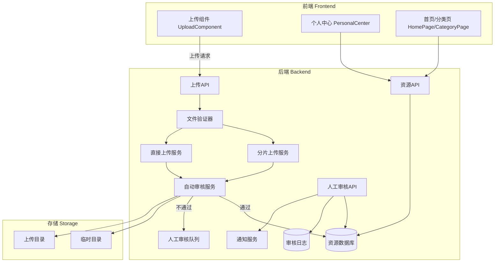

# 设计文档

## 概述

本设计文档描述设计资源上传审核功能的技术实现方案。该功能实现完整的文件上传、系统自动审核、人工审核流程，支持生产环境和开发环境两种模式，通过 `audit_status` 字段控制资源展示。

## 架构

### 系统架构图



### 审核流程图

```mermaid
flowchart TD
    A[用户上传文件] --> B{前端验证}
    B -->|失败| C[返回错误信息]
    B -->|通过| D{后端验证}
    D -->|失败| C
    D -->|通过| E{检查AUDIT_MODE}
    
    E -->|development| F[直接设置 audit_status=1]
    F --> G[返回"上传成功"]
    
    E -->|production| H{检查文件MD5}
    H -->|已存在且audit_status=1| I[返回"文件已存在"]
    H -->|不存在或可覆盖| J{文件类型}
    
    J -->|设计文件| K[验证文件有效性]
    J -->|压缩包| L[解压到临时目录]
    
    K -->|有效| M[设置 audit_status=1]
    K -->|无效| N[设置 audit_status=0]
    
    L --> O{解压结果}
    O -->|成功| P{检查内容}
    O -->|失败/加密| N
    
    P -->|有有效设计文件且无非法文件| M
    P -->|无有效文件或有非法文件| N
    
    M --> Q[返回"上传成功，已自动审核通过"]
    N --> R[返回"上传成功，等待审核"]
    
    N --> S[人工审核]
    S -->|通过| T[设置 audit_status=1]
    S -->|驳回| U[设置 audit_status=2]
    
    T --> V[发送通知"审核通过"]
    U --> W[发送通知"审核驳回"]
```

## 组件和接口

### 1. 环境配置模块

```typescript
// backend/src/config/audit.ts

interface AuditConfig {
  /** 审核模式: production | development */
  mode: 'production' | 'development';
  /** 临时文件过期时间（小时） */
  tempFileExpireHours: number;
  /** 允许的设计文件格式 */
  allowedDesignFormats: string[];
  /** 允许的压缩包格式 */
  allowedArchiveFormats: string[];
  /** 非法可执行文件扩展名 */
  illegalExecutableExtensions: string[];
  /** 缩略图尺寸 */
  thumbnailSize: { width: number; height: number };
}

const defaultConfig: AuditConfig = {
  mode: process.env.AUDIT_MODE as 'production' | 'development' || 'production',
  tempFileExpireHours: 24,
  allowedDesignFormats: ['PSD', 'AI', 'CDR', 'JPG', 'JPEG', 'PNG'],
  allowedArchiveFormats: ['ZIP', 'RAR', '7Z', 'TAR', 'GZ', 'GZIP'],
  illegalExecutableExtensions: ['EXE', 'BAT', 'SH', 'CMD', 'COM', 'MSI'],
  thumbnailSize: { width: 200, height: 200 }
};

// 注：文件格式校验支持大小写兼容（如 png/PNG、zip/ZIP 均视为有效格式），
// 避免用户因文件名大小写问题导致审核失败。
```

### 2. 文件验证服务

```typescript
// backend/src/services/fileValidationService.ts

interface FileValidationResult {
  valid: boolean;
  message?: string;
  fileHash?: string;
  fileType?: 'design' | 'archive';
}

interface FileValidationService {
  /** 验证文件格式和内容 */
  validateFile(file: Express.Multer.File): Promise<FileValidationResult>;
  
  /** 计算文件MD5哈希 */
  calculateFileHash(filePath: string): Promise<string>;
  
  /** 检查文件是否已存在 */
  checkDuplicateFile(fileHash: string): Promise<{
    exists: boolean;
    resourceId?: string;
    auditStatus?: number;
  }>;
  
  /** 验证设计文件有效性（文件头、像素信息） */
  validateDesignFile(filePath: string, format: string): Promise<boolean>;
}
```

### 3. 自动审核服务

```typescript
// backend/src/services/autoAuditService.ts

interface AutoAuditResult {
  passed: boolean;
  auditStatus: 0 | 1;
  message: string;
  extractedFiles?: ExtractedFileInfo[];
}

interface ExtractedFileInfo {
  fileName: string;
  fileSize: number;
  fileFormat: string;
  isValid: boolean;
  isIllegal: boolean;
}

interface AutoAuditService {
  /** 执行自动审核 */
  performAutoAudit(file: Express.Multer.File): Promise<AutoAuditResult>;
  
  /** 解压压缩包到临时目录 */
  extractArchive(filePath: string): Promise<{
    success: boolean;
    tempDir?: string;
    files?: ExtractedFileInfo[];
    error?: string;
  }>;
  
  /** 检查解压后的文件内容 */
  validateExtractedContent(files: ExtractedFileInfo[]): {
    hasValidDesignFile: boolean;
    hasIllegalFile: boolean;
  };
  
  /** 清理临时文件 */
  cleanupTempFiles(tempDir: string): Promise<void>;
  
  /** 清理过期临时文件（定时任务） */
  cleanupExpiredTempFiles(): Promise<void>;
}
```

### 4. 分片上传服务

```typescript
// backend/src/services/chunkUploadService.ts

interface ChunkInfo {
  uploadId: string;
  chunkIndex: number;
  totalChunks: number;
  chunkSize: number;
  uploaded: boolean;
}

interface ChunkUploadService {
  /** 初始化分片上传 */
  initChunkUpload(params: {
    fileName: string;
    fileSize: number;
    fileHash: string;
    totalChunks: number;
  }): Promise<{ uploadId: string }>;
  
  /** 上传单个分片 */
  uploadChunk(params: {
    uploadId: string;
    chunkIndex: number;
    chunkData: Buffer;
  }): Promise<{ success: boolean; uploaded: number }>;
  
  /** 获取已上传的分片信息（断点续传） */
  getUploadedChunks(uploadId: string): Promise<ChunkInfo[]>;
  
  /** 合并分片完成上传 */
  completeChunkUpload(uploadId: string): Promise<{
    success: boolean;
    filePath: string;
  }>;
  
  /** 取消分片上传 */
  cancelChunkUpload(uploadId: string): Promise<void>;
}
```

### 5. 人工审核服务

```typescript
// backend/src/services/manualAuditService.ts

interface AuditListQuery {
  pageNum: number;
  pageSize: number;
  uploaderId?: string;
  fileType?: string;
  sortBy?: 'uploadTime' | 'fileSize';
  sortOrder?: 'asc' | 'desc';
}

interface AuditListItem {
  resourceId: string;
  title: string;
  fileName: string;
  fileSize: number;
  fileFormat: string;
  uploaderId: string;
  uploaderName: string;
  uploadTime: Date;
  auditStatus: number;
  thumbnail?: string;
  extractedFiles?: ExtractedFileInfo[];
}

interface RejectReason {
  code: string;
  label: string;
}

const PRESET_REJECT_REASONS: RejectReason[] = [
  { code: 'NO_VALID_FILE', label: '无有效设计文件' },
  { code: 'FILE_CORRUPTED', label: '文件损坏' },
  { code: 'ILLEGAL_CONTENT', label: '含违规内容' },
  { code: 'PASSWORD_PROTECTED', label: '压缩包密码保护' }
];

interface ManualAuditService {
  /** 获取待审核资源列表 */
  getAuditList(query: AuditListQuery): Promise<{
    list: AuditListItem[];
    total: number;
  }>;
  
  /** 审核通过 */
  approveResource(resourceId: string, operatorId: string): Promise<void>;
  
  /** 审核驳回 */
  rejectResource(params: {
    resourceId: string;
    operatorId: string;
    reasonCode: string;
    reasonDetail?: string;
  }): Promise<void>;
  
  /** 批量审核通过 */
  batchApprove(resourceIds: string[], operatorId: string): Promise<{
    successCount: number;
    failCount: number;
    failedIds: string[];
  }>;
  
  /** 批量审核驳回 */
  batchReject(params: {
    resourceIds: string[];
    operatorId: string;
    reasonCode: string;
    reasonDetail?: string;
  }): Promise<{
    successCount: number;
    failCount: number;
    failedIds: string[];
  }>;
  
  /** 生成缩略图 */
  generateThumbnail(filePath: string, format: string): Promise<string | null>;
  
  /** 获取文件详情（用于预览） */
  getFileDetails(resourceId: string): Promise<{
    format: string;
    dimensions?: { width: number; height: number };
    resolution?: number;
    colorMode?: string;
  }>;
}
```

### 6. 审核日志服务

```typescript
// backend/src/services/auditLogService.ts

interface AuditLogEntry {
  logId: string;
  resourceId: string;
  operatorType: 'system' | 'manual';
  operatorId?: string;
  operatorName?: string;
  previousStatus: number;
  newStatus: number;
  rejectReason?: string;
  createdAt: Date;
}

interface AuditLogService {
  /** 记录审核日志 */
  logAuditAction(params: {
    resourceId: string;
    operatorType: 'system' | 'manual';
    operatorId?: string;
    previousStatus: number;
    newStatus: number;
    rejectReason?: string;
  }): Promise<void>;
  
  /** 查询审核日志 */
  getAuditLogs(query: {
    resourceId?: string;
    operatorId?: string;
    startTime?: Date;
    endTime?: Date;
    pageNum: number;
    pageSize: number;
  }): Promise<{
    list: AuditLogEntry[];
    total: number;
  }>;
}
```

### 7. 通知服务

```typescript
// backend/src/services/notificationService.ts

interface Notification {
  notificationId: string;
  userId: string;
  type: 'audit_approved' | 'audit_rejected';
  title: string;
  content: string;
  resourceId: string;
  isRead: boolean;
  createdAt: Date;
}

interface NotificationService {
  /** 发送审核结果通知 */
  sendAuditNotification(params: {
    userId: string;
    resourceId: string;
    resourceTitle: string;
    auditResult: 'approved' | 'rejected';
    rejectReason?: string;
  }): Promise<void>;
  
  /** 获取用户通知列表 */
  getUserNotifications(userId: string, query: {
    pageNum: number;
    pageSize: number;
    isRead?: boolean;
  }): Promise<{
    list: Notification[];
    total: number;
    unreadCount: number;
  }>;
  
  /** 标记通知为已读 */
  markAsRead(notificationId: string): Promise<void>;
}
```

## 数据模型

### 数据库表结构

```sql
-- 资源表扩展字段
ALTER TABLE resources ADD COLUMN IF NOT EXISTS file_hash VARCHAR(64);
ALTER TABLE resources ADD COLUMN IF NOT EXISTS extracted_files JSONB;
ALTER TABLE resources ADD COLUMN IF NOT EXISTS reject_reason VARCHAR(500);
ALTER TABLE resources ADD COLUMN IF NOT EXISTS reject_reason_code VARCHAR(50);

-- 分片上传记录表
CREATE TABLE IF NOT EXISTS chunk_uploads (
    upload_id UUID PRIMARY KEY DEFAULT gen_random_uuid(),
    user_id UUID NOT NULL REFERENCES users(user_id),
    file_name VARCHAR(255) NOT NULL,
    file_size BIGINT NOT NULL,
    file_hash VARCHAR(64) NOT NULL,
    total_chunks INT NOT NULL,
    uploaded_chunks INT DEFAULT 0,
    status VARCHAR(20) DEFAULT 'uploading', -- uploading, completed, cancelled
    temp_dir VARCHAR(500),
    created_at TIMESTAMP DEFAULT NOW(),
    updated_at TIMESTAMP DEFAULT NOW(),
    expires_at TIMESTAMP
);

-- 分片信息表
CREATE TABLE IF NOT EXISTS chunk_parts (
    part_id UUID PRIMARY KEY DEFAULT gen_random_uuid(),
    upload_id UUID NOT NULL REFERENCES chunk_uploads(upload_id) ON DELETE CASCADE,
    chunk_index INT NOT NULL,
    chunk_size INT NOT NULL,
    uploaded BOOLEAN DEFAULT FALSE,
    created_at TIMESTAMP DEFAULT NOW(),
    UNIQUE(upload_id, chunk_index)
);

-- 审核日志表
CREATE TABLE IF NOT EXISTS audit_logs (
    log_id UUID PRIMARY KEY DEFAULT gen_random_uuid(),
    resource_id UUID NOT NULL REFERENCES resources(resource_id),
    operator_type VARCHAR(20) NOT NULL, -- system, manual
    operator_id UUID REFERENCES users(user_id),
    previous_status INT NOT NULL,
    new_status INT NOT NULL,
    reject_reason VARCHAR(500),
    reject_reason_code VARCHAR(50),
    created_at TIMESTAMP DEFAULT NOW()
);

-- 通知表
CREATE TABLE IF NOT EXISTS notifications (
    notification_id UUID PRIMARY KEY DEFAULT gen_random_uuid(),
    user_id UUID NOT NULL REFERENCES users(user_id),
    type VARCHAR(50) NOT NULL,
    title VARCHAR(200) NOT NULL,
    content TEXT,
    resource_id UUID REFERENCES resources(resource_id),
    is_read BOOLEAN DEFAULT FALSE,
    created_at TIMESTAMP DEFAULT NOW()
);

-- 索引
CREATE INDEX IF NOT EXISTS idx_resources_file_hash ON resources(file_hash);
CREATE INDEX IF NOT EXISTS idx_resources_audit_status ON resources(audit_status);
CREATE INDEX IF NOT EXISTS idx_chunk_uploads_user_id ON chunk_uploads(user_id);
CREATE INDEX IF NOT EXISTS idx_chunk_uploads_status ON chunk_uploads(status);
CREATE INDEX IF NOT EXISTS idx_audit_logs_resource_id ON audit_logs(resource_id);
CREATE INDEX IF NOT EXISTS idx_audit_logs_created_at ON audit_logs(created_at);
CREATE INDEX IF NOT EXISTS idx_notifications_user_id ON notifications(user_id);
CREATE INDEX IF NOT EXISTS idx_notifications_is_read ON notifications(is_read);
CREATE INDEX IF NOT EXISTS idx_resources_audit_status_created_at ON resources(audit_status, created_at DESC);
```

### Prisma Schema 扩展

```prisma
model chunk_uploads {
  upload_id       String   @id @default(uuid()) @db.Uuid
  user_id         String   @db.Uuid
  file_name       String   @db.VarChar(255)
  file_size       BigInt
  file_hash       String   @db.VarChar(64)
  total_chunks    Int
  uploaded_chunks Int      @default(0)
  status          String   @default("uploading") @db.VarChar(20)
  temp_dir        String?  @db.VarChar(500)
  created_at      DateTime @default(now())
  updated_at      DateTime @default(now())
  expires_at      DateTime?
  
  users           users    @relation(fields: [user_id], references: [user_id])
  chunk_parts     chunk_parts[]
}

model chunk_parts {
  part_id      String   @id @default(uuid()) @db.Uuid
  upload_id    String   @db.Uuid
  chunk_index  Int
  chunk_size   Int
  uploaded     Boolean  @default(false)
  created_at   DateTime @default(now())
  
  chunk_uploads chunk_uploads @relation(fields: [upload_id], references: [upload_id], onDelete: Cascade)
  
  @@unique([upload_id, chunk_index])
}

model audit_logs {
  log_id            String   @id @default(uuid()) @db.Uuid
  resource_id       String   @db.Uuid
  operator_type     String   @db.VarChar(20)
  operator_id       String?  @db.Uuid
  previous_status   Int
  new_status        Int
  reject_reason     String?  @db.VarChar(500)
  reject_reason_code String? @db.VarChar(50)
  created_at        DateTime @default(now())
  
  resources         resources @relation(fields: [resource_id], references: [resource_id])
  users             users?    @relation(fields: [operator_id], references: [user_id])
}

model notifications {
  notification_id String   @id @default(uuid()) @db.Uuid
  user_id         String   @db.Uuid
  type            String   @db.VarChar(50)
  title           String   @db.VarChar(200)
  content         String?
  resource_id     String?  @db.Uuid
  is_read         Boolean  @default(false)
  created_at      DateTime @default(now())
  
  users           users     @relation(fields: [user_id], references: [user_id])
  resources       resources? @relation(fields: [resource_id], references: [resource_id])
}
```

## 正确性属性

*正确性属性是指在系统所有有效执行中都应保持为真的特征或行为——本质上是关于系统应该做什么的形式化陈述。属性作为人类可读规范和机器可验证正确性保证之间的桥梁。*

### Property 1: AUDIT_MODE 配置决定审核行为

*对于任意* 文件上传请求，当 AUDIT_MODE 为 "development" 时，上传成功后 audit_status 应为 1；当 AUDIT_MODE 为 "production" 时，应执行自动审核流程。

**验证: 需求 1.2, 1.3**

### Property 2: 文件验证拒绝无效文件

*对于任意* 不符合验证规则的文件（无效文件名、不支持的格式、超大小限制），上传系统应拒绝上传并返回包含错误原因的响应。

**验证: 需求 2.1, 2.2, 2.3, 2.5**

### Property 3: 分片上传支持断点续传

*对于任意* 分片上传会话，如果上传中断后恢复，系统应返回已上传的分片列表，客户端只需上传未完成的分片。

**验证: 需求 3.2, 3.5**

### Property 4: 重复文件检测

*对于任意* 文件上传，如果文件 MD5 哈希与已存在且 audit_status=1 的资源相同，系统应拒绝上传并提示文件已存在。

**验证: 需求 4.1, 4.2**

### Property 5: 批量上传部分失败不影响其他文件

*对于任意* 批量上传请求，如果部分文件验证失败，系统应继续处理其他有效文件，并返回每个文件的处理结果。

**验证: 需求 5.2, 5.4**

### Property 6: 自动审核结果决定 audit_status

*对于任意* 在生产模式下上传的文件，如果自动审核通过（有效设计文件或包含有效设计文件的压缩包），audit_status 应为 1；否则应为 0。

**验证: 需求 6.2, 6.4, 6.5, 6.6, 6.7, 6.8, 6.9**

### Property 7: 压缩包解压后临时文件清理

*对于任意* 压缩包文件的自动审核，审核完成后（无论通过或失败），临时解压目录应被删除。

**验证: 需求 6.10**

### Property 8: 人工审核操作更新 audit_status

*对于任意* 人工审核操作，审核通过应将 audit_status 设为 1，审核驳回应将 audit_status 设为 2 并存储驳回原因。

**验证: 需求 7.8, 7.9, 7.15**

### Property 9: 批量审核返回操作结果汇总

*对于任意* 批量审核操作，系统应返回成功数、失败数和失败的资源 ID 列表。

**验证: 需求 8.2, 8.3, 8.4**

### Property 10: 公开页面仅展示已审核通过的资源

*对于任意* 首页或分类页的资源查询，返回的所有资源的 audit_status 应为 1。

**验证: 需求 9.1, 9.2, 9.3**

### Property 11: audit_status 决定用户权限

*对于任意* 用户个人中心的资源，当 audit_status 为 0 或 2 时，下载和分享功能应被禁用；当 audit_status 为 1 时，所有功能应启用。

**验证: 需求 10.2, 10.3, 10.5**

### Property 12: audit_status 变更触发通知

*对于任意* audit_status 从 0 变为 1 或 2 的变更，系统应向资源所有者发送相应的通知。

**验证: 需求 11.1, 11.2**

### Property 13: 审核日志完整记录变更信息

*对于任意* audit_status 变更，系统应记录操作人（区分系统/人工）、时间戳、变更前后状态，驳回时还应记录驳回原因。

**验证: 需求 12.1, 12.2, 12.3, 12.4**

### Property 14: 上传结果返回正确的提示消息

*对于任意* 上传请求，系统应根据审核模式和审核结果返回对应的提示消息（"上传成功，已自动审核通过"/"上传成功，等待审核"/"上传成功"等）。

**验证: 需求 13.1, 13.2, 13.3, 13.4, 13.5**

## 错误处理

### 错误码定义

| 错误码 | 描述 | HTTP状态码 |
|--------|------|-----------|
| UPLOAD_001 | 文件格式不支持 | 400 |
| UPLOAD_002 | 文件大小超限 | 400 |
| UPLOAD_003 | 文件名包含非法字符 | 400 |
| UPLOAD_004 | 文件已存在 | 409 |
| UPLOAD_005 | 分片上传会话不存在 | 404 |
| UPLOAD_006 | 分片索引无效 | 400 |
| AUDIT_001 | 资源不存在 | 404 |
| AUDIT_002 | 资源已审核 | 400 |
| AUDIT_003 | 无审核权限 | 403 |
| AUDIT_004 | 驳回原因不能为空 | 400 |
| AUDIT_005 | 压缩包解压失败/密码保护 | 400 |

### 异常处理策略

1. **文件验证失败**: 立即返回错误，不保存文件
2. **压缩包解压失败**: 设置 audit_status=0，转入人工审核
3. **数据库操作失败**: 回滚事务，清理已上传文件
4. **临时文件清理失败**: 记录日志，由定时任务后续清理
5. **系统重启后临时文件清理**: 系统启动时自动执行临时文件清理任务，删除过期/未处理的临时解压文件，避免磁盘占用溢出

## 测试策略

### 单元测试

- 文件验证逻辑测试（格式、大小、文件名安全性）
- MD5 哈希计算测试
- 设计文件有效性验证测试
- 压缩包解压和内容检测测试
- 审核状态变更逻辑测试

### 属性测试

使用 fast-check 库进行属性测试，每个属性测试至少运行 100 次迭代。

测试标签格式: **Feature: resource-upload-audit, Property {number}: {property_text}**

### 集成测试

- 完整上传流程测试（前端验证 → 后端验证 → 自动审核）
- 分片上传和断点续传测试
- 人工审核流程测试
- 通知发送测试
- 审核日志记录测试

### E2E 测试

- 用户上传文件并查看审核状态
- 管理员审核资源并验证用户收到通知
- 首页/分类页资源展示验证
