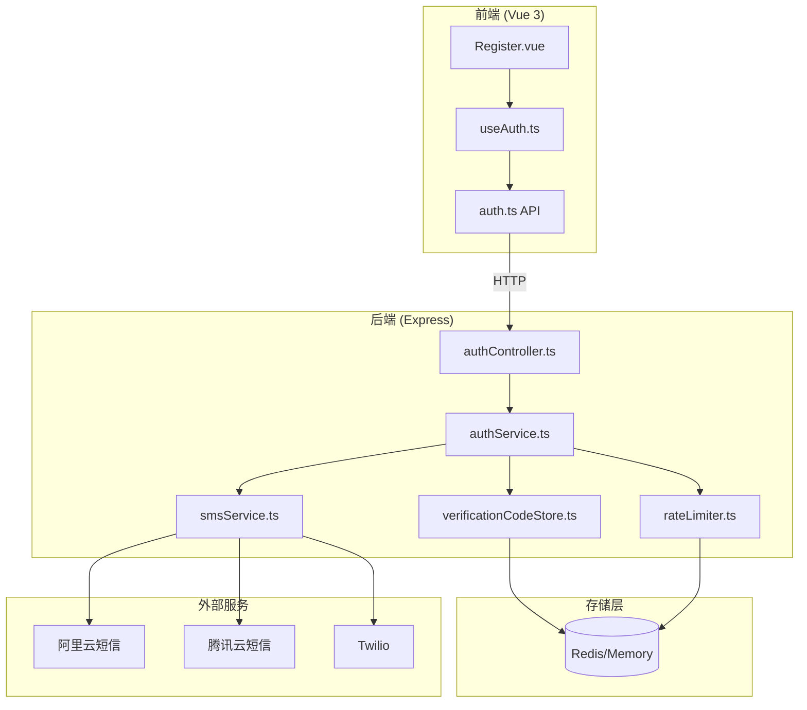

# 设计文档 - 短信验证功能

## 概述

本设计文档描述短信验证功能的技术实现方案，包括验证码的生成、存储、发送和验证流程。系统采用分层架构，支持开发环境的模拟模式和生产环境的真实短信发送。

## 架构设计

### 整体架构



### 组件职责

| 组件 | 职责 |
|------|------|
| Register.vue | 注册页面UI，处理用户交互 |
| useAuth.ts | 认证相关的组合式函数，管理状态和调用API |
| authController.ts | 处理HTTP请求，参数验证 |
| authService.ts | 认证业务逻辑，协调各服务 |
| smsService.ts | 短信发送服务，支持多服务商 |
| verificationCodeStore.ts | 验证码存储服务，支持Redis和内存 |
| rateLimiter.ts | 频率限制服务，防刷保护 |

## 组件与接口设计

### 1. 验证码存储服务 (verificationCodeStore.ts)

```typescript
/**
 * 验证码数据结构
 */
interface VerificationCode {
  code: string;           // 6位验证码
  createTime: number;     // 创建时间戳（毫秒）
  used: boolean;          // 是否已使用
}

/**
 * 验证码存储服务接口
 */
interface IVerificationCodeStore {
  /**
   * 存储验证码
   * @param phone 手机号
   * @param code 验证码
   * @param ttl 过期时间（秒），默认300秒
   */
  set(phone: string, code: string, ttl?: number): Promise<void>;
  
  /**
   * 获取验证码
   * @param phone 手机号
   * @returns 验证码数据或null
   */
  get(phone: string): Promise<VerificationCode | null>;
  
  /**
   * 标记验证码为已使用
   * @param phone 手机号
   */
  markAsUsed(phone: string): Promise<void>;
  
  /**
   * 删除验证码
   * @param phone 手机号
   */
  delete(phone: string): Promise<void>;
  
  /**
   * 检查是否存在有效验证码
   * @param phone 手机号
   */
  exists(phone: string): Promise<boolean>;
}
```

### 2. 短信发送服务 (smsService.ts)

```typescript
/**
 * 短信发送结果
 */
interface SmsSendResult {
  success: boolean;
  messageId?: string;
  errorCode?: string;
  errorMessage?: string;
}

/**
 * 短信服务接口
 */
interface ISmsService {
  /**
   * 发送验证码短信
   * @param phone 手机号
   * @param code 验证码
   * @returns 发送结果
   */
  sendVerificationCode(phone: string, code: string): Promise<SmsSendResult>;
}

/**
 * 短信服务工厂
 * 根据SMS_PROVIDER环境变量创建对应的短信服务实例
 */
function createSmsService(): ISmsService {
  const provider = process.env.SMS_PROVIDER || 'mock';
  
  switch (provider) {
    case 'aliyun':
      return new AliyunSmsService();
    case 'tencent':
      return new TencentSmsService();
    case 'twilio':
      return new TwilioSmsService();
    default:
      return new MockSmsService();
  }
}
```

### 3. 频率限制服务 (rateLimiter.ts)

```typescript
/**
 * 频率限制检查结果
 */
interface RateLimitResult {
  allowed: boolean;
  errorCode?: string;
  retryAfter?: number;  // 需要等待的秒数
  message?: string;
}

/**
 * 频率限制服务接口
 */
interface IRateLimiter {
  /**
   * 检查手机号是否可以请求验证码
   * @param phone 手机号
   */
  checkPhoneLimit(phone: string): Promise<RateLimitResult>;
  
  /**
   * 检查IP是否可以请求验证码
   * @param ip IP地址
   */
  checkIpLimit(ip: string): Promise<RateLimitResult>;
  
  /**
   * 记录一次请求
   * @param phone 手机号
   * @param ip IP地址
   */
  recordRequest(phone: string, ip: string): Promise<void>;
}
```

### 4. 认证服务扩展 (authService.ts)

```typescript
/**
 * 发送验证码请求
 */
interface SendCodeRequest {
  phone: string;
  type: 'register' | 'login' | 'reset';
}

/**
 * 验证码验证结果
 */
interface VerifyCodeResult {
  valid: boolean;
  errorCode?: string;
  message?: string;
}

/**
 * 认证服务扩展方法
 */
class AuthService {
  /**
   * 发送验证码
   * 1. 校验手机号格式
   * 2. 检查频率限制
   * 3. 生成验证码
   * 4. 存储验证码
   * 5. 发送短信
   */
  async sendVerifyCode(data: SendCodeRequest, ip: string): Promise<void>;
  
  /**
   * 验证验证码
   * 1. 从存储获取验证码
   * 2. 检查是否存在
   * 3. 检查是否过期
   * 4. 比对验证码
   * 5. 标记为已使用
   */
  async verifyCode(phone: string, code: string): Promise<VerifyCodeResult>;
}
```

## 数据模型

### Redis Key设计

| Key格式 | 用途 | 过期时间 |
|---------|------|----------|
| `register_sms_{phone}` | 存储验证码 | 5分钟 |
| `sms_count_{phone}_{date}` | 手机号每日请求计数 | 24小时 |
| `sms_last_{phone}` | 手机号上次请求时间 | 60秒 |
| `sms_ip_count_{ip}_{date}` | IP每日请求计数 | 24小时 |
| `sms_ip_last_{ip}` | IP上次请求时间 | 60秒 |

### 验证码存储格式

```json
{
  "code": "123456",
  "createTime": 1699999999999,
  "used": false
}
```

## 正确性属性

*正确性属性是系统应该满足的特性，通过属性测试来验证这些特性在所有有效输入下都成立。*

### Property 1: 手机号格式验证

*对于任意*字符串，手机号验证函数应正确识别有效手机号（11位数字，以13/14/15/17/18/19开头）和无效手机号。

**Validates: Requirements 1.1, 2.1**

### Property 2: 验证码格式验证

*对于任意*字符串，验证码格式验证函数应正确识别有效验证码（6位纯数字）和无效验证码。

**Validates: Requirements 1.8, 3.1, 3.2**

### Property 3: 验证码生成

*对于任意*次调用验证码生成函数，生成的验证码应始终为6位纯数字字符串。

**Validates: Requirements 2.5, 5.1**

### Property 4: 验证码存储与读取

*对于任意*有效手机号和验证码，存储后立即读取应能获取到相同的验证码数据。

**Validates: Requirements 2.6, 2.7**

### Property 5: 验证码验证正确性

*对于任意*存储的验证码，使用正确的验证码应验证通过，使用错误的验证码应验证失败。

**Validates: Requirements 3.3, 3.5, 3.6**

### Property 6: 验证码单次使用

*对于任意*验证码，验证成功后再次使用同一验证码应验证失败。

**Validates: Requirements 3.8, 3.9**

### Property 7: 验证码过期

*对于任意*验证码，超过5分钟后应验证失败并返回过期错误。

**Validates: Requirements 3.7, 5.2, 5.3**

### Property 8: 手机号频率限制

*对于任意*手机号，60秒内第二次请求应被拒绝；单日超过5次请求应被拒绝。

**Validates: Requirements 4.1, 4.2, 4.3, 4.4**

### Property 9: IP频率限制

*对于任意*IP地址，60秒内超过3次请求应被拒绝；单日超过20次请求应被拒绝。

**Validates: Requirements 4.6, 4.7, 4.8**

## 错误处理

### 错误码映射

```typescript
const ERROR_CODES = {
  SMS_001: { code: 400, message: '请输入正确的11位手机号' },
  SMS_002: { code: 429, message: '获取验证码过于频繁，请60秒后再试' },
  SMS_003: { code: 429, message: '今日获取验证码次数已达上限，请明日再试' },
  SMS_004: { code: 500, message: '验证码发送失败，请稍后重试' },
  SMS_005: { code: 400, message: '验证码错误，请核对后重新输入' },
  SMS_006: { code: 400, message: '验证码已过期，请重新获取' },
  SMS_007: { code: 400, message: '验证码无效或已过期' },
  SMS_008: { code: 429, message: '操作过于频繁，请稍后再试' },
  SMS_009: { code: 500, message: '系统异常，请稍后重试' },
};
```

### 异常处理策略

1. **Redis连接失败**: 降级到内存存储（开发环境）或返回SMS_009错误（生产环境）
2. **短信发送失败**: 重试2次（指数退避），失败后返回SMS_004错误
3. **验证码不存在**: 返回SMS_007错误
4. **验证码过期**: 返回SMS_006错误
5. **验证码错误**: 返回SMS_005错误

## 测试策略

### 单元测试

1. **手机号验证函数测试**
   - 测试有效手机号（各运营商号段）
   - 测试无效手机号（长度错误、非数字、错误号段）

2. **验证码生成函数测试**
   - 测试生成的验证码格式
   - 测试随机性（多次生成不重复）

3. **验证码存储服务测试**
   - 测试存储和读取
   - 测试过期机制
   - 测试标记已使用

4. **频率限制服务测试**
   - 测试60秒限制
   - 测试每日限制
   - 测试IP限制

### 属性测试

使用fast-check库进行属性测试，每个属性测试至少运行100次迭代。

```typescript
// 示例：手机号格式验证属性测试
import * as fc from 'fast-check';

describe('Phone Validation Property Tests', () => {
  // Property 1: 手机号格式验证
  it('should correctly validate phone numbers', () => {
    fc.assert(
      fc.property(fc.string(), (input) => {
        const result = validatePhone(input);
        const isValidFormat = /^1[3-9]\d{9}$/.test(input);
        return result === isValidFormat;
      }),
      { numRuns: 100 }
    );
  });
});
```

### 集成测试

1. **完整发送验证码流程**
   - 请求发送验证码
   - 验证Redis中存储了验证码
   - 验证控制台输出（mock模式）

2. **完整注册流程**
   - 发送验证码
   - 使用验证码注册
   - 验证注册成功
   - 验证验证码已删除

3. **防刷规则测试**
   - 连续请求测试60秒限制
   - 多次请求测试每日限制
